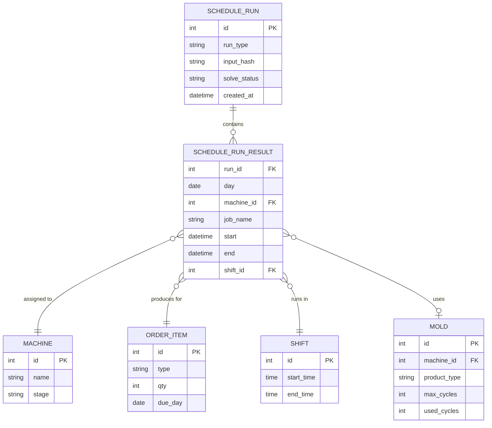

# production-scheduling — ERD

`SCHEDULE_RUN` và `SCHEDULE_RUN_RESULT` do feature `production-scheduling` sở hữu (ghi). `MACHINE`, `ORDER_ITEM`, `SHIFT`, `MOLD` do feature `master-data` sở hữu — chỉ đọc ở đây, đặt tên `ORDER_ITEM` để tránh trùng từ khoá `ORDER` trong Mermaid.

Trường `solve_status` trên `SCHEDULE_RUN` là bổ sung so với data model gốc trong `report/TECHNICAL_SPEC.md` §6 — xem marker Mục 8 của `production-scheduling-spec.md`.
