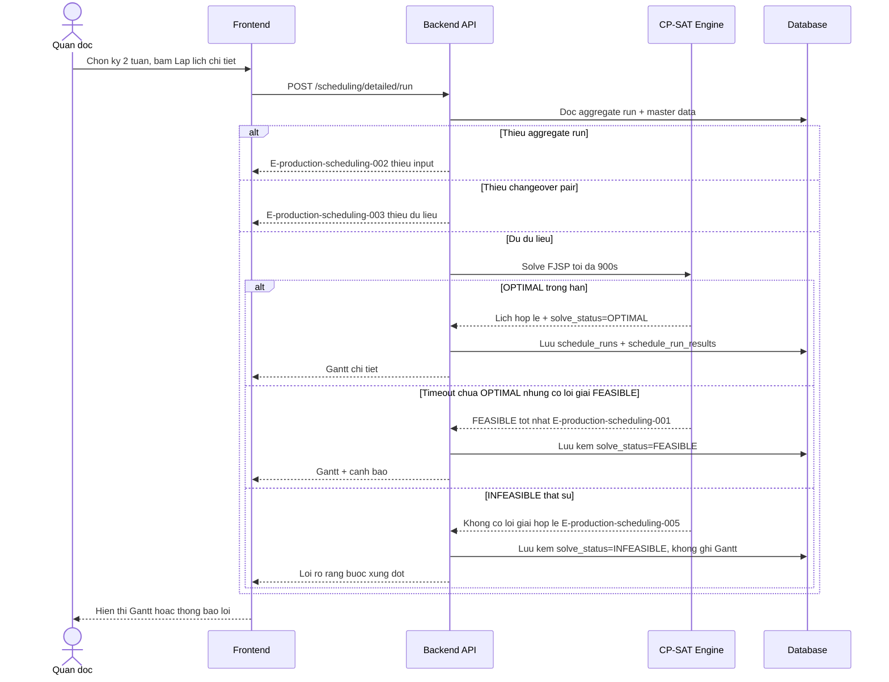
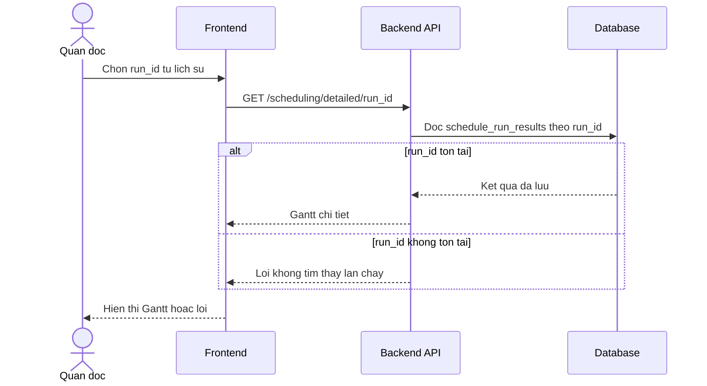

# production-scheduling — Flows

## Flow: Lập lịch chi tiết

Nhánh lỗi tham chiếu: E-production-scheduling-001, E-production-scheduling-002, E-production-scheduling-003, E-production-scheduling-004 (chèn bảo trì khuôn — xảy ra bên trong bước solve, không tách nhánh riêng ở sequence này vì không đổi luồng thành công), E-production-scheduling-005.

## Flow: Xem lại kết quả 1 lần chạy

