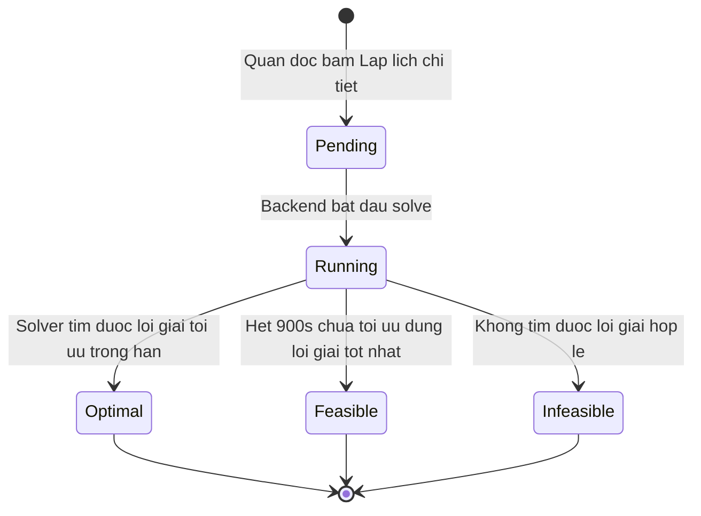

# production-scheduling — State Diagrams

## Entity: ScheduleRun (`solve_status`)

Trigger: `Pending`/`Running` là trạng thái tạm trong 1 request đồng bộ (không lưu DB); chỉ trạng thái cuối (`Optimal`/`Feasible`/`Infeasible`) được ghi vào cột `solve_status` của `schedule_runs` khi request hoàn tất.
