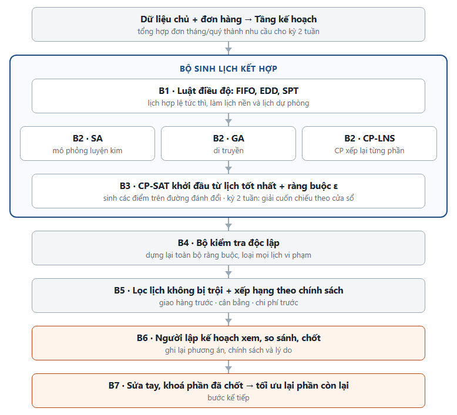
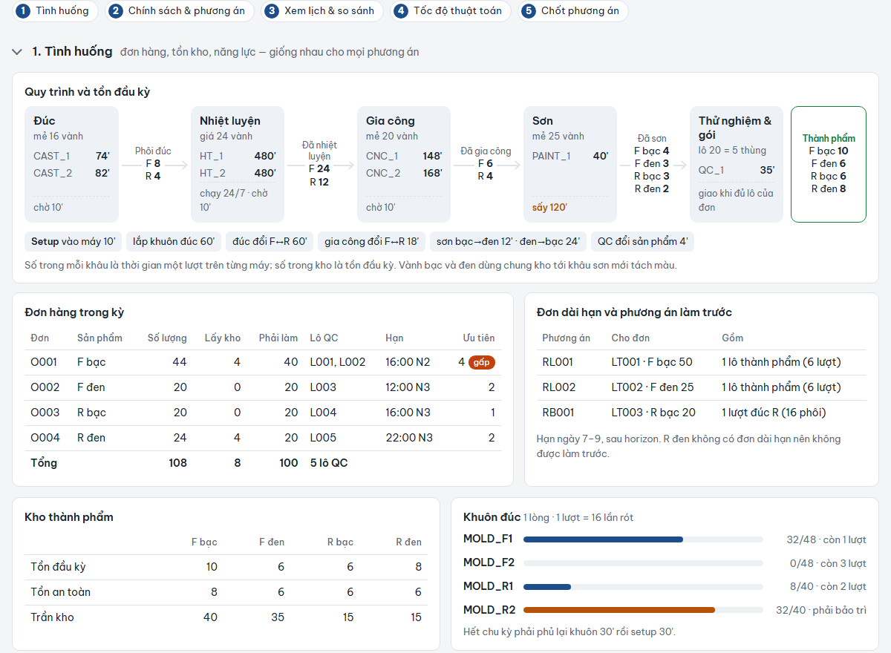
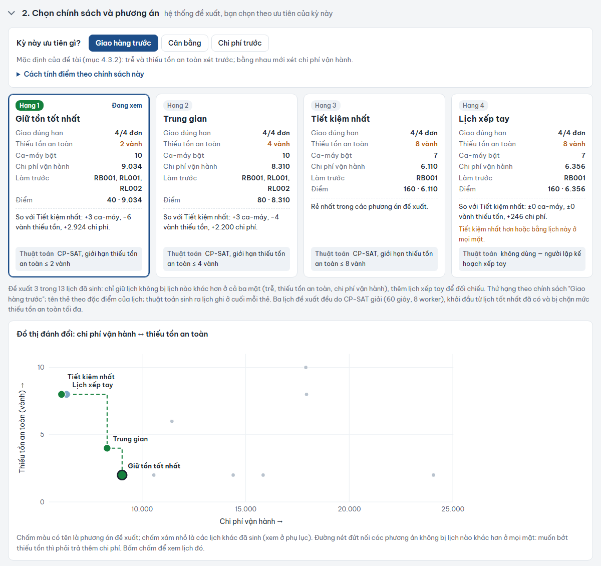
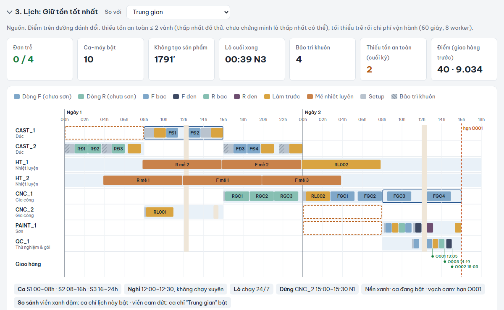
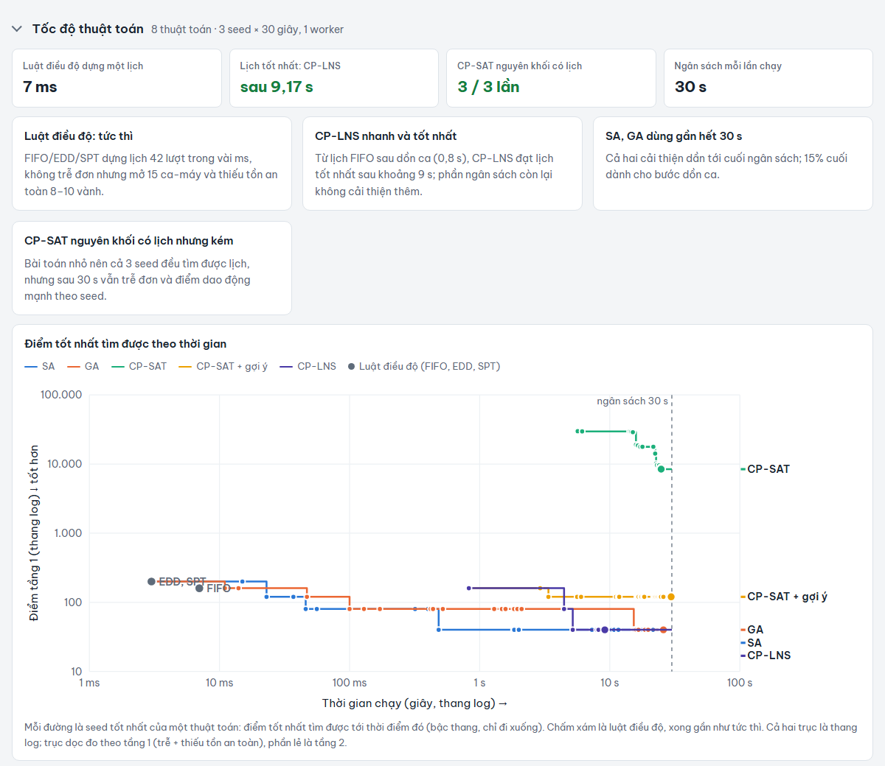

# Báo cáo tiến độ: Đồ án Hệ thống thông tin quản lý (CO5103)

**Học viên:** Võ Văn Dũng  
**Chương trình:** Cao học ngành Hệ thống thông tin quản lý  
**Học kỳ:** HK261  
**GVHD:** PGS.TS Võ Thị Ngọc Châu  
**Phiên bản:** cập nhật ngày 03/10/2026 (báo cáo sơ bộ gửi ngày 17/09/2026)

> **Về bản cập nhật này.** Báo cáo được viết lại theo 5 mục: bài toán, cơ sở lý thuyết, các nghiên cứu liên quan, giải pháp đề xuất, kết quả đạt được. Nội dung trả lời bốn góp ý của cô: bổ sung dữ liệu benchmark (Mục 3.4, 5.2), bổ sung tài liệu gần đây (Mục 2–3, từ 19 lên 32 tài liệu), lập bảng đối sánh (Mục 3.2), triển khai và đánh giá mô hình (Mục 4–5). Thay đổi lớn nhất so với báo cáo sơ bộ: đề tài **không còn chọn một thuật toán duy nhất (CP-SAT)** mà đề xuất **giải pháp kết hợp nhiều thuật toán, người lập kế hoạch chọn phương án trên đường đánh đổi** (Mục 4).

## 1. Đề xuất bài toán cụ thể

Tên đề tài đề xuất: Xây dựng tác nhân lập lịch sản xuất tạo ra lịch hợp lý, ứng dụng trong ngành sản xuất linh kiện, trường hợp nghiên cứu: sản xuất bánh xe.

Lĩnh vực: Sản xuất

### 1.1. Bối cảnh thực tế

Tại nhiều nhà máy sản xuất linh kiện quy mô vừa và lớn (trường hợp tham khảo: một nhà máy sản xuất bánh xe quy mô vừa và lớn tại Việt Nam), việc lập lịch sản xuất hiện vẫn xoay quanh các file Excel rời rạc do từng nhân viên lập kế hoạch tự quản lý theo kinh nghiệm cá nhân. Dữ liệu đơn hàng, tồn kho, tình trạng máy móc nằm rải rác trên nhiều file khác nhau giữa các bộ phận (kế hoạch, kho, sản xuất), thường xuyên lệch phiên bản và không ai chịu trách nhiệm là "bản đúng nhất". Hệ quả là ban lãnh đạo không có một nguồn dữ liệu thống nhất, đáng tin cậy để theo dõi và ra quyết định kịp thời. Cụ thể, cách làm này tồn tại các vấn đề:

- Dữ liệu phân mảnh, thiếu kiểm soát: mỗi bộ phận tự giữ một bản Excel riêng, không có cơ chế đồng bộ hay lịch sử thay đổi, dẫn đến sai lệch số liệu và mất nhiều thời gian đối chiếu thủ công mỗi khi cần báo cáo.
- Mang tính "hộp đen": ngay cả khi có số liệu, ban lãnh đạo cũng không nắm được logic đằng sau các quyết định lập lịch, vì toàn bộ nằm trong kinh nghiệm cá nhân của người lập kế hoạch chứ không được hệ thống hoá.
- Khó điều chỉnh nhanh khi có đơn hàng gấp chen ngang lịch đã lập, vì mọi thay đổi đều phải dò và sửa tay trên file Excel.
- Phụ thuộc kinh nghiệm cá nhân, khó chuẩn hoá và mở rộng khi quy mô tăng, dễ đứt gãy khi nhân sự chủ chốt nghỉ việc hoặc luân chuyển.
- Khó cân bằng đồng thời nhiều ràng buộc: số máy giới hạn (điểm nghẽn), thời gian chuyển đổi giữa các loại sản phẩm, máy chuyên dụng theo loại sản phẩm, số lượng lô sản xuất tối thiểu, bảo trì khuôn định kỳ, quản lý tồn kho, và đảm bảo máy đã bật phải được tận dụng tối đa (tránh lãng phí điện năng và nhân công đứng chờ).

### 1.2. Phát biểu bài toán

Thiết kế một tác nhân lập lịch sản xuất có khả năng:

1. Tự động sinh lịch sản xuất tối ưu hoặc gần tối ưu dựa trên đơn hàng và ràng buộc thực tế của nhà máy.
2. Tạo ra lịch sản xuất hợp lý — tuân thủ đầy đủ ràng buộc vật lý/nghiệp vụ của nhà máy, cân đối có căn cứ giữa các mục tiêu cạnh tranh (hạn giao, hiệu suất máy, tồn kho), để ban lãnh đạo có thể tin tưởng sử dụng mà không cần rà tay lại.
3. Phản ứng linh hoạt với các sự kiện gián đoạn ngoài kế hoạch (đơn hàng gấp, máy hỏng) bằng cách giải lại lịch và so sánh với lịch gốc để thấy rõ tác động.
4. Tối đa hoá hiệu suất sử dụng máy trong mỗi khung ca đã được kích hoạt, giảm thiểu lãng phí nhân công và năng lượng.

### 1.3. Phạm vi

- Dữ liệu chủ: thiết kế dữ liệu nền có cấu trúc cho hệ thống gồm danh mục máy, danh mục sản phẩm, thời gian xử lý theo từng công đoạn/sản phẩm/máy, khả năng xử lý của từng máy theo loại sản phẩm, ma trận thời gian chuyển đổi giữa các loại sản phẩm, quy mô lô theo công đoạn/sản phẩm, danh mục khuôn (tuổi thọ sử dụng, chu kỳ bảo trì), ca làm việc (3 ca/ngày) và định mức chi phí nhân công theo ca.
- Dữ liệu giao dịch: đơn hàng (mã sản phẩm, số lượng, hạn giao hàng), nguồn dữ liệu đầu vào cho ràng buộc hạn giao hàng cũng như cho phần lập kế hoạch và lập lịch bên dưới.
- Lập kế hoạch sản xuất (theo quý/tháng): tổng hợp đơn hàng đổ về theo quý/tháng thành kế hoạch sản xuất theo từng giai đoạn ngắn hơn (2 tuần), làm đầu vào cho phần lập lịch sản xuất, đúng với quy trình thực tế (đơn hàng → lập kế hoạch → lập lịch) — mô hình **hierarchical production planning** kinh điển trong OR (Hax & Meal, 1975, tài liệu tham khảo số 16). Xử lý ở mức tổng hợp nhu cầu, không cần một mô hình tối ưu riêng như phần lập lịch.
- Lập lịch sản xuất chi tiết cho một dây chuyền sản xuất đơn giản hoá (bánh sau / bánh trước), gồm **5 công đoạn chính: đúc → nhiệt luyện → gia công CNC → sơn → thử nghiệm và đóng gói**. *(Cập nhật: báo cáo sơ bộ dùng 4 công đoạn đúc → CNC → sơn → QC. Sau khi phân tích một quy trình sản xuất vành hợp kim nhôm thực tế gồm 19 công đoạn, em bổ sung công đoạn nhiệt luyện vì đây là công đoạn dài nhất và là điểm nghẽn của dây chuyền; xem Mục 5.2.)*
- Phần diễn giải quyết định (phụ trợ, không bắt buộc) đi kèm mỗi lịch được sinh ra.
- Ràng buộc/mục tiêu tối ưu hoá hiệu suất sử dụng máy khi đã bật (chi tiết ở Mục 4.2).
- Quản lý tồn kho là một phần của dữ liệu chủ (tồn đầu kỳ, tồn bán thành phẩm giữa các công đoạn, ngưỡng an toàn và sức chứa kho theo từng loại sản phẩm), dùng làm ràng buộc đầu vào cho lịch sản xuất ở mức vừa đủ (không đi sâu tối ưu tồn kho như một bài toán độc lập).

## 2. Cơ sở lý thuyết

### 2.1. Lập kế hoạch và lập lịch phân cấp

Trong quản trị sản xuất, quyết định được chia theo tầng thời gian. **Lập kế hoạch** (planning) ở tầng tháng/quý quyết định sản xuất bao nhiêu, mã nào, trong giai đoạn nào. **Lập lịch** (scheduling) ở tầng ngày/tuần quyết định việc nào chạy trên máy nào, lúc nào. Mô hình phân cấp của Hax & Meal (1975, tài liệu tham khảo số 16) cho phép giải từng tầng bằng phương pháp phù hợp, tầng trên làm đầu vào cho tầng dưới. Đề tài theo đúng cấu trúc này: tầng kế hoạch tổng hợp đơn hàng thành nhu cầu cho từng kỳ 2 tuần; tầng lập lịch là phần tối ưu chính.

### 2.2. Phân loại bài toán lập lịch

**Job-shop (JSP):** mỗi công việc gồm chuỗi thao tác theo thứ tự cố định, mỗi thao tác chạy trên một máy định sẵn. Đây là lớp bài toán NP-khó kinh điển, có bộ dữ liệu chuẩn Taillard và Lawrence (tài liệu số 1, 2).

**Flexible job-shop (FJSP):** mỗi thao tác được chọn một máy trong tập máy đủ điều kiện, nên phải quyết định cả gán máy lẫn thứ tự (Dauzère-Pérès et al., 2024, số 12). Vì mọi sản phẩm của đề tài đi qua các công đoạn theo cùng một thứ tự, bài toán cũng gần lớp **hybrid flow shop**, tức dây chuyền nhiều công đoạn, mỗi công đoạn có máy song song (Ruiz & Vázquez-Rodríguez, 2010, số 21).

**Các mở rộng thực tế** mà đề tài cần, theo các tổng quan trên và tổng quan về thời gian chuyển đổi của Allahverdi (2015, số 22):

| Mở rộng | Ý nghĩa |
|---|---|
| Thời gian chuyển đổi phụ thuộc trình tự | Đổi từ sản phẩm A sang B tốn thời gian khác đổi từ B sang A |
| Tài nguyên phụ (khuôn) | Thao tác cần đồng thời máy và khuôn; khuôn có tuổi thọ và chu kỳ bảo trì |
| Lô và mẻ theo công đoạn | Mỗi công đoạn có cỡ lô riêng (lò nhiệt luyện chạy theo mẻ), các công đoạn nối nhau qua kho bán thành phẩm |
| Lịch làm việc theo ca | Máy chỉ chạy trong ca đã mở; mở ca phát sinh chi phí nhân công |
| Tồn kho và giao hàng | Tồn an toàn, sức chứa kho, giao hàng theo đơn và hạn |

### 2.3. Bài toán đa mục tiêu

Lịch sản xuất phải cân đối các mục tiêu xung đột nhau: giao đúng hạn, giữ tồn an toàn, giảm chuyển đổi, giảm số ca phải mở. Có ba cách xử lý phổ biến:

- **Tổng có trọng số:** gộp các mục tiêu thành một điểm. Cách này đơn giản, nhưng cho phép một mục tiêu bù cho mục tiêu khác (ví dụ tiết kiệm chi phí bù cho giao trễ).
- **Thứ tự ưu tiên (lexicographic):** tối ưu mục tiêu quan trọng nhất trước, chỉ khi bằng nhau mới xét mục tiêu tiếp theo.
- **Tối ưu Pareto:** một lịch được gọi là **không bị trội** nếu không có lịch nào khác tốt hơn hoặc bằng nó ở mọi mục tiêu. Tập các lịch không bị trội tạo thành **đường đánh đổi**. Phương pháp **ràng buộc ε** sinh từng điểm trên đường này: giới hạn một mục tiêu không vượt quá ε rồi tối ưu các mục tiêu còn lại.

Khi trọng số giữa các mục tiêu là chính sách quản lý chứ không phải số đo được, cách tiếp cận Pareto có ưu điểm: thay vì chốt sẵn một bộ trọng số, hệ thống đưa ra các phương án đánh đổi để người quản lý chọn.

### 2.4. Các nhóm phương pháp giải

| Nhóm | Đại diện | Ưu điểm | Hạn chế |
|---|---|---|---|
| Luật điều độ | FIFO, EDD (hạn sớm trước), SPT (gia công ngắn trước) | Tức thì, dễ hiểu, gần cách lập lịch thủ công | Chất lượng thấp, không nhìn xa |
| Metaheuristic | Mô phỏng luyện kim (SA), di truyền (GA) | Linh hoạt, cải thiện dần, mở rộng tốt theo quy mô | Không đảm bảo tối ưu, phụ thuộc seed |
| Quy hoạch ràng buộc | CP-SAT của OR-Tools (số 4); so sánh CP-SAT và CP Optimizer trong PyJobShop (số 9) | Biểu diễn tự nhiên ràng buộc phức tạp, có cận dưới để biết khoảng cách tới tối ưu | Thời gian giải tăng nhanh theo quy mô |
| Lai CP và tìm kiếm | Tìm kiếm lân cận lớn (LNS): mở lại một phần lịch cho CP giải lại | Tận dụng sức mạnh CP trên bài toán con nhỏ | Không có cận toàn cục |
| Phân rã theo thời gian | Rolling horizon: chia kỳ dài thành các cửa sổ, giải lần lượt (Li et al., 2025, số 13) | Giải được bài toán dài | Mỗi cửa sổ không thấy tương lai xa |
| Học máy | Học tăng cường, mạng nơ-ron đồ thị (số 23–25), kết hợp CP với học sâu (số 26) | Ra quyết định nhanh sau huấn luyện | Cần dữ liệu huấn luyện, khó giải thích |

Trong CP-SAT, mỗi thao tác là một **biến khoảng thời gian** (bắt đầu, thời lượng, kết thúc). Ràng buộc **không chồng lấn** bảo đảm một máy không làm hai việc cùng lúc. Bộ giải có thể nhận một **lịch gợi ý** làm điểm xuất phát và cho phép **cố định** một phần biến; hai cơ chế này là nền cho phần kết hợp ở Mục 4.

### 2.5. Tái lập lịch và diễn giải

**Tái lập lịch:** Vieira et al. (2003, số 31) phân biệt chiến lược, chính sách kích hoạt (khi nào lập lại) và phương pháp (sửa phần nào). Khi có đơn gấp hay máy hỏng, phần lịch đã thực hiện phải giữ nguyên, chỉ xếp lại phần tương lai.

**Diễn giải:** người quản lý cần hiểu vì sao lịch được xếp như vậy trước khi tin dùng. Các kỹ thuật liên quan gồm:

- **Đường găng** (Kelley & Walker, 1959, số 14): chuỗi thao tác quyết định thời điểm hoàn thành.
- **Phân tích độ nhạy:** nới lỏng từng ràng buộc để tìm điểm nghẽn (Nedbálek & Novák, 2025, số 15).
- **Giải thích phản thực:** "nếu thay đổi X thì lịch thay đổi thế nào" (Mehdiyev et al., 2024, số 7).
- **Các khung XAI cho vận trù học** (De Bock et al., 2024, số 17; Garn & Amirghasemi, 2025, số 18).

Với bài toán đa mục tiêu, **trình bày đường đánh đổi giữa các phương án** cũng là một cách diễn giải: người dùng thấy rõ muốn được thêm cái gì thì phải trả bằng cái gì.

## 3. Các nghiên cứu liên quan

### 3.1. Tổng quan theo hướng nghiên cứu

- **Ràng buộc sản xuất đặc thù.** Cheng et al. (2024, số 8) giải FJSP có phối hợp máy–khuôn và thời gian lắp khuôn bằng tiến hoá vi phân đa mục tiêu. Ghaleb et al. (2021, số 20) lập lịch thời gian thực kết hợp bảo trì theo tình trạng máy. Deliktaş et al. (2024, số 10) công bố 43 instance FJSP có thời gian chuyển đổi theo họ sản phẩm.
- **Quy hoạch ràng buộc.** PyJobShop (Lan & Berkhout, 2025, số 9) đóng gói CP cho nhiều lớp bài toán lập lịch và đối chứng CP-SAT với CP Optimizer trên hơn 9.000 instance công khai.
- **Học máy cho lập lịch.** Zhang et al. (2020, số 23) học luật điều độ bằng học tăng cường sâu. Song et al. (2023, số 24) mở rộng cho FJSP bằng mạng nơ-ron đồ thị. Smit et al. (2025, số 25) tổng quan hướng GNN. Li et al. (2025, số 13) dùng học máy để quyết định biến nào giữ cố định giữa các cửa sổ rolling horizon. Echeverria et al. (2025, số 26) kết hợp CP với học sâu cho FJSP động. Chalumeau et al. (2021, số 32) dùng học tăng cường bên trong bộ giải CP.
- **Diễn giải.** Wang & Chen (2024, số 5; 2025, số 6) xây kỹ thuật XAI cho kết quả GA trong lập lịch. Mehdiyev et al. (2024, số 7) dùng giải thích phản thực đa mục tiêu. Hu et al. (2026, số 27) đề xuất chính sách lập lịch dạng chương trình đọc được. Liu et al. (2026, số 28) tổng quan kiến trúc hệ thống quyết định lập lịch có học máy, phân biệt cấu hình do bộ giải dẫn dắt, chia sẻ quyền quyết định, và do mô hình dẫn dắt.

### 3.2. Bảng đối sánh

Các ô chỉ ghi nội dung đã xác nhận được từ nguồn. "Chưa xác nhận" nghĩa là nguồn em tiếp cận được (thường là tóm tắt) không nêu, không có nghĩa công trình không có.

| Nghiên cứu | Loại bài toán | Thuật toán/phương pháp | Ràng buộc sản xuất đặc thù | Khả năng giải thích | Xử lý gián đoạn động | Dữ liệu dùng |
|---|---|---|---|---|---|---|
| Wang & Chen 2024 (ESWA) [5] | JSP (bán dẫn) | GA + hậu xử lý XAI (decision tree, contribution diagram) | Không | Có — diễn giải sau khi giải | Không | Tổng hợp mô phỏng |
| Wang & Chen 2025 (sách Springer) [6] | JSP tổng quát | GA + các thuật toán bio-inspired | Không đặc thù ngành | Có — khung XAI hệ thống | Không | Minh hoạ tổng hợp |
| Mehdiyev et al. 2024 (Cognitive Computation) [7] | JSP (dự đoán quy trình + tối ưu) | Predictive process monitoring + NSGA-II | Không | Có — phản thực đa mục tiêu | Ngầm định (kịch bản what-if) | Log quy trình thực tế |
| Cheng et al. 2024 (IEEE Access) [8] | FJSP + tài nguyên khuôn | Differential evolution đa mục tiêu cải tiến (MODE) | Có — phối hợp máy–khuôn, setup khuôn | Không | Không | Tổng hợp |
| Ghaleb et al. 2021 (J. Manufacturing Systems) [20] | FJSP động | GA lai | Có — suy giảm máy, bảo trì theo tình trạng | Không | Có — lập lịch thời gian thực | Chưa xác nhận |
| Lan & Berkhout 2025 (PyJobShop) [9] | FJSP/JSP/RCPSP tổng quát | CP-SAT & CP Optimizer | Tổng quát, không đặc thù | Không | Không | >9.000 instance benchmark công khai |
| Zhang et al. 2020 (NeurIPS) [23] | JSP | Học tăng cường sâu + biểu diễn đồ thị | Không | Không | Chưa xác nhận | Instance sinh ngẫu nhiên và benchmark công khai |
| Song et al. 2023 (IEEE TII) [24] | FJSP | GNN + học tăng cường sâu | Không | Không | Chưa xác nhận | Instance sinh ngẫu nhiên và benchmark công khai |
| Li et al. 2025 (ICLR) [13] | FJSP kỳ dài | Rolling horizon + học máy chọn biến cố định | Không đặc thù | Không | Chưa xác nhận | Tổng hợp |
| Echeverria et al. 2025 (ESWA) [26] | FJSP động | CP kết hợp học sâu | Không đặc thù | Không | Có | Chưa xác nhận |
| Hu et al. 2026 (arXiv) [27] | Lập lịch | Học tăng cường cho ra chính sách dạng chương trình | Chưa xác nhận | Có — chính sách đọc và sửa được | Chưa xác nhận | Chưa xác nhận |
| Nedbálek & Novák 2025 (ICORES) [15] | RCPSP | Nới lỏng ràng buộc để tìm điểm nghẽn | Không đặc thù | Có — chỉ ra điểm nghẽn | Không | Chưa xác nhận |
| Nguyễn Hồng Phúc et al. 2026 (TNU JST) [29] | FJSP + nguồn lực ngoài | Mô hình toán + GA | Có — tăng ca, thuê ngoài | Không | Chưa xác nhận | Chưa xác nhận |
| Nguyễn Hữu Mùi & Vũ Đình Hòa 2012 [30] | JSP | GA + tìm kiếm lân cận | Không | Không | Không | Chưa xác nhận |
| Deliktaş et al. 2024 (Data in Brief) [10] | FJSP cellular + setup theo họ SP | Không quy định thuật toán (bộ dữ liệu) | Có — setup phụ thuộc trình tự theo họ | Không | Không | 43 instance chuẩn công khai |
| Mota et al. 2020 (Zenodo) [11] | Lập lịch dây chuyền thực tế + năng lượng | GA | Có — dữ liệu năng lượng thực | Không | Không | Dữ liệu thực đo |
| **Đề tài này (Dũng, 2026)** | FJSP 5 công đoạn, 2 tầng lập kế hoạch / lập lịch | **Kết hợp:** luật điều độ + SA/GA + CP-LNS + CP-SAT ràng buộc ε, lọc Pareto, người chọn (Mục 4) | **Đã cài:** 3 ca/ngày, setup theo trình tự, khuôn dùng chung + bảo trì theo chu kỳ, lô theo công đoạn, tồn bán thành phẩm, tồn an toàn, sức chứa kho, giao hàng theo đơn | Đường đánh đổi, so sánh hai lịch, lý giải theo lịch; đường găng, độ nhạy: **dự kiến** | Đơn gấp và bảo trì biết trước: **đã có**; sự cố phát sinh giữa chừng: **dự kiến** | 2 bộ tổng hợp tự xây; Taillard, Lawrence, Deliktaş: **có dữ liệu, chưa chạy** |

### 3.3. Nghiên cứu trong nước

Báo cáo sơ bộ chỉ tìm được 1 luận án cùng trường giải bài toán khác: lập lịch cá nhân (Trang, 2021, số 19). Đợt rà soát này tìm thêm 2 công trình trực tiếp về lập lịch sản xuất:

- Nguyễn Hồng Phúc et al. (2026, số 29): FJSP kết hợp tăng ca và thuê ngoài, giải bằng mô hình toán và GA.
- Nguyễn Hữu Mùi & Vũ Đình Hòa (2012, số 30): GA cho JSP.

Cả hai khác bộ ràng buộc của đề tài (khuôn, ca bật, tồn kho).

### 3.4. Dữ liệu benchmark công khai

| Bộ dữ liệu | Nguồn | Giấy phép | Quy mô | Vai trò trong đề tài |
|---|---|---|---|---|
| Taillard ta01–ta80 | Taillard (1993) [1]; bản lưu Zenodo | CC BY 4.0 | 80 instance | Kiểm tra lõi job-shop (makespan) |
| OR-Library, gồm Lawrence la01–la40 | Beasley (1990) [3], Lawrence (1984) [2] | Tự do cho nghiên cứu | 82 instance | Như trên |
| FJSP trong môi trường cell | Deliktaş et al. (2024) [10]; Mendeley Data | CC BY 4.0 | 43 instance (nhỏ/vừa/lớn) | Lựa chọn máy, setup theo họ sản phẩm |
| Dây chuyền sản xuất – năng lượng | Mota et al. (2020) [11]; Zenodo | MIT | 3 tệp JSON/XLSX | Tham chiếu tham số thời gian/năng lượng |

**Các cổng dữ liệu mở theo góp ý của cô:**

| Cổng | Kết quả tra cứu |
|---|---|
| data.gov (Mỹ) | Tra theo tag "manufacturing": chủ yếu là chỉ số sản xuất công nghiệp, tỷ lệ sử dụng công suất (Federal Reserve) và dữ liệu đánh giá năng lượng. Không có dữ liệu cấp máy/công đoạn/đơn hàng |
| data.gov.vn | Không tìm thấy bộ dữ liệu sản xuất công nghiệp hay lập lịch nào. Lộ trình công bố dữ liệu mở cho doanh nghiệp mới bắt đầu từ 2026 |
| Kaggle | Có 3 ứng viên chưa kiểm chứng được nội dung: cuộc thi "Job Shop Scheduling Challenge" (2026), bộ "10000 Jobshop Problem data" và bộ "Manufacturing Production Data". Cần tải về để kiểm tra cấu trúc trước khi dùng |

Các bộ benchmark công khai chỉ kiểm tra được phần lõi job-shop. Không bộ nào có đủ ca làm việc, khuôn dùng chung, tồn bán thành phẩm và giao hàng theo đơn. Vì vậy đề tài tự xây thêm dữ liệu nghiệp vụ (Mục 5.2).

### 3.5. Khoảng trống và vị trí của đề tài

Các công trình trên đã có lời giải mạnh cho từng mảng riêng: khuôn, bảo trì, học chính sách, diễn giải. Vì vậy đề tài **không tuyên bố là công trình đầu tiên** kết hợp các mảng này. *(Báo cáo sơ bộ có nhận định "chưa tìm thấy công trình nào kết hợp đủ cả 3 trục". Sau khi rà soát rộng hơn, em thấy nhận định đó chưa đủ căn cứ nên rút lại.)*

Hai khoảng trống mà đề tài nhắm tới:

1. Đa số công trình chọn **một** thuật toán rồi so với các thuật toán khác. Trong khi đó, thực nghiệm của đề tài (Mục 5) cho thấy mỗi thuật toán mạnh ở một vùng khác nhau: CP tốt ở bài nhỏ, metaheuristic tốt ở bài lớn, luật điều độ cho lời giải tức thì.
2. Đa số trả về **một** lịch tối ưu theo một hàm mục tiêu cố định. Trong thực tế, trọng số giữa giao hàng và chi phí là quyết định quản lý, thay đổi theo từng kỳ.

Đóng góp phù hợp của đề tài là **xây dựng và kiểm chứng một giải pháp lập lịch kết hợp** cho một dây chuyền cụ thể, gồm ba phần: nhiều thuật toán cùng sinh lịch, mọi lịch qua bộ kiểm tra độc lập, và người lập kế hoạch chọn trên đường đánh đổi.

## 4. Giải pháp đề xuất: lập lịch kết hợp nhiều thuật toán, người lập kế hoạch chọn

### 4.1. Ý tưởng

Báo cáo sơ bộ chọn CP-SAT làm thuật toán duy nhất. Thực nghiệm cho thấy cách đó không bền:

- Ở bộ 3 ngày, CP-SAT nguyên khối cho lịch kém nhất trong 30 giây.
- Ở bộ 2 tuần, CP-SAT nguyên khối không tìm được lịch nào trong 120 giây.

Ngược lại, khi được khởi đầu từ lịch tốt nhất mà các thuật toán khác đã tìm được, CP-SAT lại cho các lịch tốt nhất (Mục 5.3).

Vì vậy giải pháp đề xuất **không chọn một thuật toán**. Hệ thống gồm 3 phần:

- **Danh mục thuật toán phối hợp:** mỗi thuật toán đảm nhận phần nó làm tốt nhất, lịch của thuật toán trước làm điểm xuất phát cho thuật toán sau.
- **Bộ kiểm tra lịch độc lập:** mọi lịch đều phải qua.
- **Bước chọn có người tham gia:** hệ thống đề xuất các phương án trên đường đánh đổi, người lập kế hoạch chọn theo ưu tiên của kỳ và ghi lý do.

Hình 1 tóm tắt quy trình của giải pháp.

### 4.2. Mô hình hoá

Bài toán được mô hình hoá thành FJSP 5 công đoạn với đầy đủ ràng buộc ở bảng dưới. Cột cuối cho biết trạng thái cài đặt tại 03/10/2026.

| Ràng buộc | Mô tả | Trạng thái |
|---|---|---|
| Trình tự công đoạn | Đúc → nhiệt luyện → CNC → sơn → thử nghiệm và đóng gói, có thời gian chờ chuyển công đoạn (ví dụ sấy sơn 120 phút) | Đã cài |
| Giới hạn và khả năng xử lý của máy | Một máy làm một việc tại một thời điểm; mỗi sản phẩm chỉ chạy trên tập máy đủ điều kiện | Đã cài |
| Chuyển đổi phụ thuộc trình tự | Thời gian setup theo cặp sản phẩm liền kề, ví dụ sơn bạc → đen 12 phút, đen → bạc 24 phút | Đã cài |
| Lô theo công đoạn | Cỡ lượt riêng mỗi công đoạn (đúc 16, lò 24, gia công 20, sơn 25, đóng gói 20), nối nhau qua kho bán thành phẩm | Đã cài |
| Khuôn dùng chung và bảo trì | Khuôn lắp được lên mọi máy đúc; hết chu kỳ phải bảo trì | Đã cài |
| Ca làm việc | 3 ca/ngày; máy chỉ chạy trong ca đã mở; lò nhiệt luyện chạy liên tục | Đã cài |
| Dừng máy theo kế hoạch | Máy không khả dụng trong khung bảo trì | Đã cài |
| Hạn giao, tồn an toàn, sức chứa kho | Phạt trễ hạn có trọng số theo ưu tiên đơn; tồn thành phẩm tại các mốc kiểm tra phải đạt ngưỡng an toàn và không vượt sức chứa | Đã cài |
| Sản xuất trước cho đơn dài hạn | Phương án tuỳ chọn: tận dụng ca trống để làm trước, bù tồn an toàn | Đã cài |
| Sự cố phát sinh giữa chừng | Giữ phần đã thực hiện, xếp lại phần tương lai | Chưa cài |

**Mục tiêu** gồm hai nhóm:

- **Mức phục vụ:** độ trễ có trọng số, thiếu hụt tồn an toàn.
- **Chi phí vận hành:** thời gian không tạo sản phẩm trong ca đã mở (gồm chờ, setup, bảo trì), số lượng làm trước, tồn dư.

Mọi lịch được chấm bằng cùng một bộ trọng số. Việc so sánh giữa các lịch do **chính sách** quyết định (Mục 4.5), không phải do một tổng cố định.

### 4.3. Bộ sinh lịch kết hợp

| Bước | Thuật toán | Vai trò trong giải pháp | Vì sao đặt ở đây |
|---|---|---|---|
| B1 | FIFO, EDD, SPT | Cho lịch hợp lệ tức thì; làm lịch nền và lịch dự phòng | Dựng lịch 42 lượt trong vài ms, 269 lượt trong 0,22 s |
| B2 | SA, GA | Tìm thứ tự ưu tiên, thiên hướng chọn máy, độ lùi giờ để gom ca, có bật phương án làm trước hay không | Mở rộng tốt theo quy mô; tốt nhất ở bộ 2 tuần |
| B2 | CP-LNS | Từ lịch luật tốt nhất, mỗi vòng mở lại một khung giờ, hai máy, một công đoạn hoặc 20% ngẫu nhiên cho CP-SAT xếp lại | Tốt và nhanh nhất ở bộ 3 ngày (đạt lịch tốt nhất sau khoảng 9 giây) |
| B3 | CP-SAT khởi đầu từ lịch tốt nhất, ràng buộc ε | Giới hạn thiếu tồn an toàn ≤ ε vành, tối thiểu trễ rồi chi phí; lặp với nhiều ε để sinh đường đánh đổi | Có lịch tốt làm xuất phát nên CP-SAT tập trung cải thiện thay vì tìm lời giải đầu tiên |
| B3' | CP-SAT cuốn chiếu | Với kỳ 2 tuần: chia cửa sổ khoảng 60 lượt, giải lần lượt, ghép lại | CP-SAT nguyên khối không giải được 269 lượt; cỡ 60 lượt CP giải tốt |

Cách phối hợp này bám theo các hướng trong tài liệu: khởi tạo nóng và LNS là kỹ thuật lai CP – tìm kiếm phổ biến; rolling horizon theo Li et al. (2025, số 13). Điểm mới của đề tài là ghép chúng thành một quy trình, đặt mỗi thuật toán đúng chỗ dựa trên bằng chứng thực nghiệm.

### 4.4. Bộ kiểm tra lịch độc lập

Mọi lịch, dù do thuật toán nào sinh ra hay do người xếp tay, đều được dựng lại từ dữ liệu đầu vào và kiểm tra lại:

- trình tự, máy và khuôn, setup, bảo trì, ca;
- lượng bán thành phẩm và thành phẩm tại mọi thời điểm;
- trần kho, phân bổ hàng về đơn.

Bộ kiểm tra không tin các cờ "hợp lệ" do thuật toán tự báo. Kèm 64 kiểm thử tự động, trong đó có các lịch cố tình làm sai để bảo đảm bộ kiểm tra phát hiện được lỗi. Đây là điều kiện để giải pháp kết hợp đáng tin: các thuật toán khác nhau được so trên cùng một thước đo.

### 4.5. Lọc phương án và xếp hạng theo chính sách

Từ tất cả lịch hợp lệ, hệ thống giữ lại **các lịch không bị trội** trên ba mặt: trễ hạn, thiếu tồn an toàn, chi phí vận hành. Lịch xếp tay được giữ thêm để đối chiếu. Các phương án được đặt tên theo đặc điểm: *Tiết kiệm nhất*, *Trung gian*, *Giữ tồn tốt nhất*. Mỗi phương án ghi rõ thuật toán nào sinh ra nó.

Người lập kế hoạch chọn **chính sách** của kỳ để xếp hạng:

| Chính sách | Cách so | Khi nào dùng |
|---|---|---|
| Giao hàng trước (mặc định) | Trễ và thiếu tồn an toàn xét trước; bằng nhau mới xét chi phí | Kỳ có đơn gấp, khách quan trọng |
| Cân bằng | Cộng mọi thành phần theo trọng số thành một điểm | Kỳ bình thường |
| Chi phí trước | Chi phí vận hành xét trước; trễ và tồn chỉ để phân định | Đơn có thể lùi hạn, cần tiết kiệm nhân công |

Chính sách chỉ đổi **thứ tự ưu tiên**, không đổi trọng số. Nhờ vậy cùng một tập lịch có thể xếp hạng lại tức thì mà không cần giải lại.

### 4.6. Người lập kế hoạch xem, so sánh và chốt (bản demo)

Bản demo tương tác mô phỏng màn hình làm việc của người lập kế hoạch, gồm 5 bước.

**Bước 1 – Tình huống:** quy trình 5 công đoạn kèm tồn đầu kỳ ở từng kho, đơn hàng, phương án làm trước, kho thành phẩm và tình trạng khuôn. Mọi phương án dùng chung tình huống này.

**Bước 2 – Chọn chính sách và phương án:** các phương án đề xuất hiển thị dạng thẻ, kèm đồ thị đánh đổi giữa chi phí vận hành và thiếu tồn an toàn.

**Bước 3 – Xem lịch và so sánh:** biểu đồ Gantt theo máy, có ca đang bật, nghỉ giữa ca, dừng máy, hạn đơn gấp và mốc giao hàng. Có thể chọn một phương án khác để so từng chỉ số và từng ca-máy chênh lệch. Kèm theo là bảng giao hàng, tồn cuối kỳ và mục "vì sao xếp như vậy".

**Bước 4 – Tốc độ thuật toán:** điểm tốt nhất tìm được theo thời gian của từng thuật toán. Bước này cho thấy vì sao cần phối hợp: luật điều độ có lịch ngay, CP-LNS hội tụ nhanh, CP-SAT nguyên khối chậm và kém.

**Bước 5 – Chốt phương án:** ghi lịch được chọn, chính sách và lý do. Quyết định phải kèm lý do để giải thích được về sau.

Trong bản demo, nhật ký quyết định mới lưu trong trình duyệt. Trong sản phẩm, quyết định sẽ lưu vào cơ sở dữ liệu cùng kịch bản và người chọn. Bước tiếp theo (B7) là cho phép sửa tay, khoá phần đã chốt rồi để CP-SAT tối ưu lại phần còn lại. Bộ giải đã hỗ trợ cố định một phần lịch; phần giao diện chưa làm.

### 4.7. Lớp diễn giải phụ trợ

Bản demo đã có ba hình thức diễn giải:

- đồ thị đánh đổi giữa các phương án;
- so sánh từng chỉ số và từng ca-máy giữa hai lịch;
- mục "vì sao xếp như vậy" cho từng lịch, giải thích cách thuật toán sinh ra nó, quyết định làm trước, và tồn bán thành phẩm dư.

Phân tích đường găng, phân tích độ nhạy và giải thích phản thực vẫn là phần dự kiến. Các tính năng này là phụ trợ, không phải điều kiện bắt buộc của mục tiêu "lịch hợp lý".

## 5. Kết quả đạt được

### 5.1. Tổng hợp theo góp ý của GVHD

| # | Góp ý của cô | Tình trạng | Kết quả | Vị trí |
|---|---|---|---|---|
| 1 | Bổ sung dữ liệu benchmark (data.gov, data.gov.vn, Kaggle…) | Đã làm phần lớn | 4 bộ công khai + 2 bộ tự xây; đã tra 3 cổng dữ liệu mở, chưa có bộ phù hợp | Mục 3.4, 5.2 |
| 2 | Bổ sung tài liệu tham khảo, nhất là tài liệu gần đây | Đã xong đợt 1 | Từ 19 lên **32 tài liệu**; **16 tài liệu xuất bản 2024–2026**; thêm 2 công trình trong nước | Mục 2–3 |
| 3 | Lập bảng đối sánh | Đã xong | Bảng 17 dòng, có trạng thái thực tế của đề tài | Mục 3.2 |
| 4 | Triển khai mô hình và đánh giá hiệu quả | Đã có kết quả thăm dò | 8 thuật toán + giải pháp kết hợp + bộ kiểm tra độc lập + demo; chạy trên 2 bộ dữ liệu | Mục 4, 5.3–5.5 |

### 5.2. Dữ liệu thực nghiệm

Để thông số sát thực tế, em phân tích một video quy trình sản xuất vành xe máy hợp kim nhôm của một nhà máy thật, khép kín 19 công đoạn, gom thành 6 giai đoạn. Từ đó mô hình rút gọn thành 5 công đoạn chính. *(Báo cáo sơ bộ dùng 4 công đoạn. Em bổ sung nhiệt luyện vì đây là công đoạn dài nhất, 8 giờ mỗi mẻ, và là điểm nghẽn của dây chuyền.)* Thông số là **ước tính có ghi giả định**, không phải số đo của nhà máy.

| Bộ dữ liệu | Kỳ lập lịch | Đơn hàng | Lượt sản xuất | Máy / khuôn | Đặc điểm |
|---|---|---|---|---|---|
| Bộ 3 ngày | 3 ngày | 4 đơn, 108 vành | 42 | 8 máy, 4 khuôn | Có lịch xếp tay để so với cách làm thủ công |
| Bộ 2 tuần | 14 ngày | 24 đơn, 980 vành | 269 | 8 máy, 4 khuôn | Nghỉ Chủ nhật, 2 đợt bảo trì máy, 2 đơn gấp, khách nhận hàng đúng giờ hẹn |

Cả hai bộ được sinh bằng chương trình có tham số. Trước khi dùng, chương trình tự kiểm tra đủ hàng cho mọi đơn và tải máy không vượt công suất.

**Thiết lập:** mọi thuật toán chạy tuần tự trên cùng máy tính, cùng ngân sách thời gian, CP-SAT 1 luồng. Thuật toán có yếu tố ngẫu nhiên chạy 3 seed (11, 29, 47). Mỗi lần chạy lưu đầu vào, cấu hình, lịch và log để tái lập. Điểm ghi theo dạng **tầng 1 · tầng 2**: tầng 1 là mức phục vụ (trễ, thiếu tồn an toàn), tầng 2 là chi phí vận hành. Điểm nhỏ hơn là tốt hơn, so tầng 1 trước.

### 5.3. Kết quả trên bộ 3 ngày

**Từng thuật toán riêng lẻ** (30 giây/lần chạy, 18/18 lần chạy cho lịch hợp lệ):

| Thuật toán | Lịch tốt nhất (3 seed) | Thiếu tồn an toàn (vành) | Ca-máy phải mở |
|---|---:|---:|---:|
| CP-LNS | 40 · 10.564 | 2 | 11 |
| SA | 40 · 14.397 | 2 | 13 |
| GA | 40 · 15.843 | 2 | 14 |
| CP-SAT khởi đầu từ lịch EDD | 120 · 11.440 | 6 | 10 |
| FIFO | 160 · 17.938 | 8 | 15 |
| EDD / SPT | 200 · 17.904 | 10 | 15 |
| CP-SAT nguyên khối | 8.410 · 24.067 (1 đơn trễ) | 2 | 19 |
| Lịch xếp tay | 160 · 6.356 | 8 | 7 |

**Giải pháp kết hợp** (bước B3: CP-SAT khởi đầu từ lịch tốt nhất đã có, ràng buộc ε, 60 giây, 8 luồng):

| Phương án đề xuất | Sinh bởi | Điểm | Thiếu tồn an toàn | Ca-máy | So với lịch tốt nhất của một thuật toán riêng lẻ |
|---|---|---:|---:|---:|---|
| **Giữ tồn tốt nhất** | CP-SAT, ε ≤ 2 | **40 · 9.034** | 2 | 10 | Cùng mức phục vụ với CP-LNS, chi phí vận hành thấp hơn 14% và bớt 1 ca-máy |
| Trung gian | CP-SAT, ε ≤ 4 | 80 · 8.310 | 4 | 10 | Đổi 2 vành tồn an toàn lấy chi phí thấp hơn 8% |
| **Tiết kiệm nhất** | CP-SAT, ε ≤ 8 | **160 · 6.110** | 8 | 7 | Cùng mức phục vụ và số ca-máy với lịch xếp tay, chi phí vận hành thấp hơn 4% |

Trong 13 lịch đã sinh, 3 lịch không bị trội đều do bước B3 tạo ra. **Không có thuật toán riêng lẻ nào cho lịch không bị trội**, kể cả lịch xếp tay. Đồ thị đánh đổi (Hình 3) cho thấy người lập kế hoạch có lựa chọn rõ ràng: muốn giảm thiếu tồn an toàn từ 8 xuống 2 vành thì phải mở thêm 3 ca-máy và tăng chi phí vận hành khoảng 48%.

*Lưu ý:* bước B3 dùng cấu hình 60 giây, 8 luồng, khác các thuật toán riêng lẻ (30 giây, 1 luồng), nên so sánh trên đây là so **giải pháp kết hợp** với **từng thành phần**, không phải so công bằng từng thuật toán. Chưa phương án nào được chứng minh tối ưu; ε ≤ 2 là mức thấp nhất đã thử, chưa chứng minh là thấp nhất có thể.

### 5.4. Kết quả trên bộ 2 tuần (120 giây/lần chạy)

| Thuật toán | Lịch hợp lệ / số lần chạy | Đơn trễ (lịch tốt nhất) | Tầng 1 (lịch tốt nhất) |
|---|---:|---:|---:|
| **SA** | 3/3 | **1** | **24.845** |
| GA | 3/3 | 2 | 61.430 |
| EDD | 1/1 | 5 | 323.465 |
| FIFO | 1/1 | 5 | 365.305 |
| SPT | 1/1 | 5 | 389.245 |
| CP-SAT khởi đầu từ lịch EDD | 3/3 | 5 | 323.465 (không cải thiện) |
| CP-LNS | 3/3 | 5 | 323.465 (không cải thiện) |
| CP-SAT nguyên khối | 0/3 | — | Không tìm được lịch trong 120 giây |

**Nhận xét:**

- So với luật EDD, SA giảm đơn trễ từ 5 xuống 1 và giảm tầng 1 khoảng 92%. Kết quả còn dao động theo seed: tầng 1 của SA là 148.455 / 24.845 / 57.110 ở ba seed.
- Ở quy mô 269 lượt, các cấu hình CP không cải thiện được lịch ban đầu. CP-LNS mỗi vòng vẫn dựng lại mô hình đủ 269 lượt (khoảng 5,4 giây) nên bài toán con không nhỏ đi thật.
- Kết quả này **củng cố lý do chọn giải pháp kết hợp**: ở quy mô lớn, B2 (SA) gánh phần tìm lịch tốt, còn CP cần chạy cuốn chiếu (B3') hoặc LNS chỉ dựng các lượt được mở. Mã cuốn chiếu đã viết xong nhưng chưa có đợt đánh giá đầy đủ nên báo cáo chưa nêu số liệu. Bước B3 với ràng buộc ε chưa chạy trên bộ này.

### 5.5. Sản phẩm đã xây dựng

| Thành phần | Nội dung | Trạng thái |
|---|---|---|
| Thư viện mô hình | 8 thuật toán dùng chung dữ liệu, hàm mục tiêu và bộ kiểm tra; CP-SAT cuốn chiếu | Đã có; cuốn chiếu đang đánh giá |
| Bộ kiểm tra độc lập | Kiểm tra lại toàn bộ ràng buộc, kèm 64 kiểm thử tự động | Đã có |
| Bộ dữ liệu | 2 bộ tổng hợp sinh bằng chương trình có tham số; 4 bộ benchmark công khai | Đã có; benchmark công khai chưa chạy |
| Backend / frontend | FastAPI gọi bộ giải; Next.js quản lý dữ liệu, xem kế hoạch và Gantt | Đã có bản chạy được |
| Demo chọn phương án | Tình huống, phương án đề xuất, đồ thị đánh đổi, Gantt so sánh, tốc độ thuật toán, chốt kèm lý do | Bản mẫu tương tác |

**Đối chiếu tiêu chí đánh giá trong báo cáo sơ bộ:**

| Tiêu chí | Kết quả hiện tại |
|---|---|
| Lịch hợp lệ 100% | Đạt trên 2 bộ dữ liệu: mọi lịch được xuất đều qua bộ kiểm tra độc lập; lần chạy không có lịch được báo rõ, không xuất lịch giả |
| Hiệu suất sử dụng máy ≥ 90% trong ca đã bật | **Chưa đạt**: đo được khoảng 28–52%. Tải tối thiểu của dây chuyền chỉ 10–56% tuỳ công đoạn và mục tiêu ưu tiên giao hàng trước, nên tiêu chí cần định nghĩa lại (ví dụ tính trên công đoạn điểm nghẽn) |
| Diễn giải lịch (phụ trợ) | Một phần: đồ thị đánh đổi, so sánh hai lịch, lý giải theo lịch. Đường găng, độ nhạy chưa có |
| Thời gian giải chấp nhận được, cảnh báo khi chưa tối ưu | Đạt ở bộ 3 ngày (vài giây đến 60 giây); trạng thái giải luôn hiển thị. Bộ 2 tuần cần cuốn chiếu |
| Chất lượng trên benchmark công khai | Chưa đánh giá |

### 5.6. Giới hạn

- Mỗi bộ chỉ có một tập dữ liệu và 3 seed, nên đây là **thử nghiệm thăm dò**, chưa đủ kết luận thống kê.
- Dữ liệu là dữ liệu tổng hợp; trọng số mục tiêu là giả định chính sách, chưa quy đổi từ chi phí thật. Em đã thử 7 biến thể trọng số trên bộ 3 ngày và thứ hạng đầu bảng không đổi.
- Giải pháp kết hợp mới chạy đủ các bước trên bộ 3 ngày; bộ 2 tuần chưa có bước B3.
- Chưa có tái lập lịch khi sự cố phát sinh giữa chừng.

### 5.7. Kế hoạch tiếp theo

1. Hoàn tất CP-SAT cuốn chiếu và chạy đủ giải pháp kết hợp (B1–B5) trên bộ 2 tuần.
2. Chạy lõi CP-SAT và luật điều độ trên Taillard và Lawrence, so với lời giải tốt nhất đã công bố (sai lệch tương đối RPD).
3. Tải và kiểm tra 3 bộ dữ liệu ứng viên trên Kaggle, duyệt trực tiếp data.gov.vn, lập bảng các bộ đã xem kèm lý do chọn/loại.
4. Đưa bước chọn phương án từ bản demo vào frontend, lưu quyết định vào cơ sở dữ liệu; làm bước B7 (sửa tay, khoá phần đã chốt, tối ưu lại).
5. Tái lập lịch khi có đơn gấp hoặc máy hỏng giữa chừng, theo khung của Vieira et al. (2003, số 31).
6. Định nghĩa lại chỉ tiêu hiệu suất sử dụng máy; cài đường găng và phân tích độ nhạy.

Em kính mong cô góp ý về hướng giải pháp kết hợp (Mục 4) và phạm vi đánh giá trên benchmark công khai.

## Tài liệu tham khảo

Tài liệu số 1–19 giữ nguyên số thứ tự của báo cáo sơ bộ (đã đính chính metadata); số 20–32 là tài liệu bổ sung trong đợt này.

1. Taillard, E. (1993). Benchmarks for basic scheduling problems. *European Journal of Operational Research*, 64(2), 278–285.
2. Lawrence, S. (1984). *Resource constrained project scheduling: An experimental investigation of heuristic scheduling techniques*. GSIA, Carnegie Mellon University.
3. Beasley, J. E. (1990). OR-Library: Distributing test problems by electronic mail. *Journal of the Operational Research Society*, 41(11), 1069–1072.
4. Google OR-Tools — CP-SAT Solver. https://developers.google.com/optimization/cp/cp_solver
5. Wang, Y. C., & Chen, T. (2024). Adapted techniques of explainable artificial intelligence for explaining genetic algorithms on the example of job scheduling. *Expert Systems with Applications*, 237, 121369. https://doi.org/10.1016/j.eswa.2023.121369
6. Wang, Y. C., & Chen, T. (2025). *Explainable and Customizable Job Sequencing and Scheduling: Advancing Production Control and Management with XAI*. Springer. https://doi.org/10.1007/978-3-031-85374-6
7. Mehdiyev, N., Majlatow, M., & Fettke, P. (2024). Counterfactual Explanations in the Big Picture: An Approach for Process Prediction-Driven Job-Shop Scheduling Optimization. *Cognitive Computation*, 16, 2674–2700. https://doi.org/10.1007/s12559-024-10294-0
8. Cheng, Y., Xie, Z., Xin, Y., Chen, K., & Zarei, R. (2024). Flexible Job Shop Scheduling Method for Optimizing Mold Resource Setup Time. *IEEE Access*, 12, 33486–33503. https://doi.org/10.1109/ACCESS.2024.3372396
9. Lan, L., & Berkhout, J. (2025). PyJobShop: Solving scheduling problems with constraint programming in Python. *arXiv:2502.13483*. https://arxiv.org/abs/2502.13483
10. Deliktaş, D., Özcan, E., Üstün, Ö., & Torkul, O. (2024). A benchmark dataset for multi-objective flexible job shop cell scheduling. *Data in Brief*, 52, 109946. https://doi.org/10.1016/j.dib.2023.109946 (dataset: https://data.mendeley.com/datasets/rtzby7pv7m/1)
11. Mota, B., Gomes, L., Faria, P., Ramos, C., & Vale, Z. (2020). Production line dataset for task scheduling and energy optimization – Schedule Optimization (v0.1) [Dataset]. Zenodo. https://doi.org/10.5281/zenodo.4106746
12. Dauzère-Pérès, S., Ding, J., Shen, L., & Tamssaouet, K. (2024). The flexible job shop scheduling problem: A review. *European Journal of Operational Research*, 314(2), 409–432. https://doi.org/10.1016/j.ejor.2023.05.017
13. Li, S., Ouyang, W., Ma, Y., & Wu, C. (2025). Learning-Guided Rolling Horizon Optimization for Long-Horizon Flexible Job-Shop Scheduling. In *International Conference on Learning Representations (ICLR 2025)*. https://openreview.net/forum?id=Aly68Y5Es0
14. Kelley, J. E., & Walker, M. R. (1959). Critical-path planning and scheduling. In *Papers presented at the December 1–3, 1959, eastern joint IRE-AIEE-ACM computer conference (IRE-AIEE-ACM '59, Eastern)*, ACM Press, 160–173. https://doi.org/10.1145/1460299.1460318
15. Nedbálek, L., & Novák, A. (2025). Bottleneck Identification in Resource-Constrained Project Scheduling via Constraint Relaxation. In *Proceedings of the 14th International Conference on Operations Research and Enterprise Systems (ICORES 2025)*, 340–347. https://doi.org/10.5220/0013253700003893
16. Hax, A. C., & Meal, H. C. (1975). Hierarchical integration of production planning and scheduling. In M. A. Geisler (Ed.), *Studies in Management Sciences, Vol. 1: Logistics* (pp. 53–69). North-Holland/American Elsevier.
17. De Bock, K. W., Coussement, K., De Caigny, A., Słowiński, R., Baesens, B., Boute, R. N., Choi, T. M., Delen, D., Kraus, M., Lessmann, S., Maldonado, S., Martens, D., Óskarsdóttir, M., Vairetti, C., Verbeke, W., & Weber, R. (2024). Explainable AI for Operational Research: A defining framework, methods, applications, and a research agenda. *European Journal of Operational Research*, 317(2), 249–272. https://doi.org/10.1016/j.ejor.2023.09.026
18. Garn, W., & Amirghasemi, M. (2025). Transparency of combinatorial optimisations via machine learning and explainable AI. *Annals of Operations Research*, 354, 427–458. https://doi.org/10.1007/s10479-025-06684-8
19. Trang, H. S. (2021). *Một số phương pháp tiếp cận cho bài toán lập lịch cá nhân* [Luận án Tiến sĩ]. Trường Đại học Bách Khoa – ĐHQG-HCM. https://grad.hcmut.edu.vn/hv/download/LATS/8140009/TOM_TAT_LATS_THSon.pdf
20. Ghaleb, M., Taghipour, S., & Zolfagharinia, H. (2021). Real-time integrated production-scheduling and maintenance-planning in a flexible job shop with machine deterioration and condition-based maintenance. *Journal of Manufacturing Systems*, 61, 423–449. https://doi.org/10.1016/j.jmsy.2021.09.018
21. Ruiz, R., & Vázquez-Rodríguez, J. A. (2010). The hybrid flow shop scheduling problem. *European Journal of Operational Research*, 205(1), 1–18. https://doi.org/10.1016/j.ejor.2009.09.024
22. Allahverdi, A. (2015). The third comprehensive survey on scheduling problems with setup times/costs. *European Journal of Operational Research*, 246(2), 345–378. https://doi.org/10.1016/j.ejor.2015.04.004
23. Zhang, C., Song, W., Cao, Z., Zhang, J., Tan, P. S., & Xu, C. (2020). Learning to Dispatch for Job Shop Scheduling via Deep Reinforcement Learning. *Advances in Neural Information Processing Systems*, 33.
24. Song, W., Chen, X., Li, Q., & Cao, Z. (2023). Flexible Job-Shop Scheduling via Graph Neural Network and Deep Reinforcement Learning. *IEEE Transactions on Industrial Informatics*, 19(2), 1600–1610. https://doi.org/10.1109/TII.2022.3189725
25. Smit, I. G., Zhou, J., Reijnen, R., Wu, Y., Chen, J., Zhang, C., Bukhsh, Z., Zhang, Y., & Nuijten, W. P. M. (2025). Graph neural networks for job shop scheduling problems: A survey. *Computers & Operations Research*, 176, 106914. https://doi.org/10.1016/j.cor.2024.106914
26. Echeverria, I., Murua, M., & Santana, R. (2025). Leveraging constraint programming in a deep learning approach for dynamically solving the flexible job-shop scheduling problem. *Expert Systems with Applications*, 265, 125895. https://doi.org/10.1016/j.eswa.2024.125895
27. Hu, C., Zhang, Y., & Baier, H. (2026). Scheduling That Speaks: An Interpretable Programmatic Reinforcement Learning Framework. *arXiv:2605.18454* (preprint). https://arxiv.org/abs/2605.18454
28. Liu, A., Lin, S., Chen, J., Wu, P., & Shen, Z. M. (2026). Machine Learning for Scheduling Decision Systems: A Critical Review of Architecture, Assurance, and Deployment. *arXiv:2512.22642v3* (preprint). https://arxiv.org/abs/2512.22642v3
29. Nguyễn Hồng Phúc, Lê Thị Thanh Hương, Nguyễn Thúy Vi, & Tiền Tú Trinh (2026). Mô hình tối ưu điều độ job-shop linh hoạt kết hợp hoạch định nguồn lực thuê ngoài. *TNU Journal of Science and Technology*, 231(02), 204–212. https://doi.org/10.34238/tnu-jst.14459
30. Nguyễn Hữu Mùi & Vũ Đình Hòa (2012). Một thuật toán di truyền hiệu quả cho bài toán lập lịch Job Shop. *Tạp chí Khoa học và Công nghệ*, 50, 565–577. https://vjs.ac.vn/jst/article/view/9529
31. Vieira, G. E., Herrmann, J. W., & Lin, E. (2003). Rescheduling Manufacturing Systems: A Framework of Strategies, Policies, and Methods. *Journal of Scheduling*, 6, 39–62. https://doi.org/10.1023/A:1022235519958
32. Chalumeau, F., Coulon, I., Cappart, Q., & Rousseau, L.-M. (2021). SeaPearl: A Constraint Programming Solver guided by Reinforcement Learning. *arXiv:2102.09193*. https://arxiv.org/abs/2102.09193
