# Các phương pháp giải bài toán và đề xuất lựa chọn

**Ngày:** 18/09/2026. **Trạng thái:** nghiên cứu và đề xuất, chưa chạy thực nghiệm so sánh.

## 1. Kết luận đề xuất

Giữ **OR-Tools CP-SAT** làm bộ giải chính, nhưng đánh giá lựa chọn bằng khả năng biểu diễn đúng nghiệp vụ và kết quả thực nghiệm, không mặc định CP-SAT tốt nhất. Kết hợp với:

1. Bộ chuẩn hoá nhu cầu, chia/gộp lô và kiểm tra dữ liệu đầu vào.
2. Bộ dựng lịch khả thi dùng FIFO/EDD/SPT làm baseline và nguồn lời giải gợi ý.
3. Bộ kiểm tra lịch độc lập, áp dụng cho mọi thuật toán.
4. Tái lập lịch theo sự kiện; bảo toàn lịch đã chạy, cân nhắc ổn định lịch tương lai.
5. Hint, rolling horizon, sau đó LNS nếu thử nghiệm cho thấy cần tăng tốc.

Lý do: các ràng buộc máy, trình tự, ca và khuôn cần được kiểm soát chặt; đồ án cá nhân có thời gian hữu hạn; dự án đã có prototype CP-SAT. Nghiên cứu PyJobShop cho thấy CP-SAT cạnh tranh trên các bộ job-shop được khảo sát, đồng thời CP Optimizer tốt hơn ở một số nhóm khác; kết quả này hỗ trợ lựa chọn ban đầu chứ không chứng minh hiệu quả trên toàn bộ nghiệp vụ bánh xe. [Nguồn: Lan & Berkhout](https://arxiv.org/abs/2502.13483).

## 2. Phạm vi và cách nghiên cứu

Đọc [yêu cầu](../problem-requirements/problem_requirements.md), phần mục tiêu/mô hình trong hai tài liệu gốc, bản khảo sát cũ và kiểm tra sự hiện diện của prototype trong `poc/`, `model/`. Không chạy lại prototype trong đợt nghiên cứu này; mô tả “đã kiểm chứng” là thông tin từ tài liệu dự án, không phải xác nhận thực nghiệm mới.

Tìm kiếm theo các cụm: flexible job shop review; hybrid flow shop; MILP/CP scheduling; sequence-dependent setups; metaheuristics; learning to dispatch; rolling horizon; rescheduling; quantum annealing. Ưu tiên bài nghiên cứu gốc, trang nhà xuất bản, preprint của tác giả, tài liệu/mã ví dụ chính thức của solver. Mức tiếp cận nguồn được ghi ở mục 10; không suy đoán kết quả toàn văn từ abstract.

Khảo sát bao phủ các họ chính; đây **không phải systematic review với quy trình PRISMA**, không tuyên bố đầy đủ mọi công bố hay thuật toán. Các đánh giá “nên dùng”, “chi phí triển khai” và lộ trình là nhận định thiết kế riêng cho đề tài.

## 3. Hiểu đúng bài toán trước khi chọn thuật toán

### 3.1. FJSP và hybrid flow shop

Tài liệu hiện gọi là FJSP. Có thể dùng mô hình FJSP tổng quát, nhưng **machine eligibility riêng lẻ chưa đủ để phân biệt job shop với flow shop**. Nếu mọi lô đi cùng thứ tự đúc → CNC → sơn → QC và máy phân thành nhóm theo công đoạn, bài toán có cấu trúc **hybrid/flexible flow shop với máy đủ điều kiện**. Nếu tuyến công nghệ khác nhau, quay lại công đoạn hoặc tài nguyên dùng xuyên công đoạn, mô hình FJSP tổng quát phù hợp hơn. Giữ mô hình linh hoạt, đồng thời ghi rõ trường hợp nghiên cứu có tuyến cố định. [Nguồn: Ruiz & Vázquez-Rodríguez, 2010](https://doi.org/10.1016/j.ejor.2009.09.024).

Đây là điều chỉnh cách diễn đạt học thuật, không yêu cầu thay lõi CP-SAT. Tổng quan FJSP cung cấp khung phân loại các dạng linh hoạt và phương pháp giải, nhưng không xác lập một phương pháp thắng mọi biến thể. [Nguồn: Dauzère-Pérès et al., 2024](https://doi.org/10.1016/j.ejor.2023.05.017).

### 3.2. Các quyết định thực sự phải giải

| Quyết định | Ví dụ trong đề tài | Hệ quả |
|---|---|---|
| Sản xuất bao nhiêu, chia/gộp thế nào | Gộp hai đơn bánh trước thành một lô | Không chỉ sắp thứ tự các job đã có |
| Chọn máy/khuôn | Chọn CNC đủ điều kiện, chọn khuôn tương thích | Cần assignment và tài nguyên dùng chung |
| Chọn thứ tự | Bánh trước → bánh sau gây đổi khuôn | Setup tính trên cặp liền kề |
| Chọn thời điểm và ca | Mở ca nào, có đi qua giờ nghỉ không | Phải có lịch khả dụng rõ ràng |
| Bảo trì | Đạt ngưỡng số lần đúc thì nghỉ khuôn | Trạng thái sử dụng tích luỹ, không chỉ lịch nghỉ định sẵn |
| Giao hàng và tồn kho | Dùng tồn đầu kỳ rồi sản xuất phần còn thiếu | Cần liên kết sản xuất, QC, phân bổ và giao hàng |
| Sửa lịch | Máy hỏng hoặc đơn gấp | Không được sửa phần quá khứ; đo tác động phần tương lai |

Vì vậy không thể lấy một solver FJSP tối thiểu makespan có sẵn rồi coi đã giải đủ yêu cầu.

### 3.3. “Hợp lý” không đồng nghĩa với “đã chứng minh tối ưu”

Một lịch hợp lý cần khả thi theo mô hình đúng, KPI chấp nhận được, đánh đổi rõ ràng và có thể thực thi. Lịch tối ưu trên mô hình thiếu bảo trì vẫn có thể sai nghiệp vụ. Lịch heuristic hoặc RL có thể hợp lệ nếu bộ dựng lịch và bộ kiểm tra đủ ràng buộc. Ngược lại, trạng thái `FEASIBLE` của CP-SAT chỉ xác nhận có nghiệm khả thi; `UNKNOWN` không chứng minh vô nghiệm. [Nguồn trạng thái solver: Google](https://developers.google.com/optimization/cp/cp_solver).

## 4. Bản đồ phương pháp

Các hàng dưới đây thuộc nhiều tầng khác nhau: mô hình, thuật toán tìm kiếm, chính sách vận hành và công cụ đánh giá. Có thể kết hợp chúng; không nên xếp tất cả thành các đối thủ thay thế ngang hàng.

| Họ phương pháp | Cách tiếp cận | Điểm mạnh | Hạn chế với đề tài | Vai trò đề xuất |
|---|---|---|---|---|
| CP / CP-SAT | Biến thời gian, khoảng hoạt động, suy diễn ràng buộc và tìm kiếm | Biểu diễn tài nguyên/trình tự tốt; có nghiệm và cận khi tìm được | Setup, khuôn và ca vẫn cần mô hình đúng; có thể chậm | Lõi |
| MILP / MIP | Biến gán máy, thứ tự hoặc thời gian; bất đẳng thức tuyến tính | Kết hợp lượng sản xuất, chi phí, tồn kho thuận lợi | Big-M yếu hoặc mô hình time-indexed lớn | Đối chứng nhỏ; phương án thay thế có căn cứ |
| SAT / SMT / MaxSAT | Mã hoá logic, thứ tự, số học, phạt mềm | Chính xác trong mô hình; phù hợp ràng buộc logic | Tự xây cấu trúc scheduling tốn công | Không ưu tiên |
| Branch-and-bound/cut | Duyệt cây với cận và cắt | Chứng minh tối ưu khi hoàn tất | Tự viết solver riêng không phù hợp tiến độ | Dùng qua solver |
| Dynamic programming, A*, nhãn trạng thái | Khai thác cấu trúc trạng thái | Hữu ích cho bài con nhỏ, tìm kiếm chính xác | Bùng nổ trạng thái khi nhiều máy/khuôn/tồn kho | Bài con, kiểm tra instance rất nhỏ |
| Dispatching rules | FIFO, EDD, SPT, CR, ATC/ATCS | Dễ cài, nhanh, dễ làm baseline | Thiển cận; phải có bộ dựng lịch hợp lệ | Baseline, hint, fallback có kiểm tra |
| Heuristic xây dựng | Chèn việc, nhóm họ sản phẩm, bottleneck-first, shifting bottleneck | Tận dụng cấu trúc sản xuất | Cần sửa cho máy linh hoạt và ràng buộc bổ sung | Baseline nâng cao |
| Local search | Đổi máy, đổi vị trí, chèn hoặc hoán đổi | Dễ tận dụng lịch ban đầu | Kẹt cực trị địa phương; move có thể phá tính khả thi | Bước cải thiện nhẹ |
| TS, SA, ILS, VNS, GRASP | Tìm kiếm quỹ đạo, thoát cực trị | Linh hoạt, không cần dữ liệu huấn luyện | Thiết kế neighbourhood và repair quyết định chất lượng | Một baseline mở rộng |
| GA, memetic, DE | Quần thể lời giải, lai ghép, đột biến | Tìm kiếm rộng, ghép đa mục tiêu thuận tiện | Giải mã hợp lệ và tuning tốn công | Thay thế nếu có thực nghiệm tốt |
| ACO, PSO và swarm | Học thiên hướng chọn thứ tự/gán máy | Dễ thử nhiều hướng tìm kiếm | Mã hoá rời rạc khó; tên thuật toán không bảo đảm hiệu quả | Khảo sát, chưa triển khai |
| LNS / ALNS / CP repair | Huỷ một phần lịch, tối ưu lại phần đó | Tái sử dụng CP, xử lý vùng khó | Tốn nhiều lần solve; cận bài con không là cận toàn cục | Mở rộng ưu tiên |
| Decomposition | Benders, Lagrangian, column generation, fix-and-optimize | Tách phần lượng/assignment và sequencing | Thiết kế cuts/cột/cận khó | Khi mô hình nguyên khối thật sự quá lớn |
| Rolling horizon | Giải cửa sổ chồng lấn, chốt phần gần | Giảm quy mô và hỗ trợ điều chỉnh | Thiển cận, hiệu ứng cuối kỳ | Mở rộng vận hành |
| Robust/stochastic/fuzzy | Bất định bằng tập, kịch bản hoặc số mờ | Xử lý biến động có mô hình | Cần dữ liệu/giả định đáng tin; tăng kích thước | Hướng tiếp theo |
| ML giám sát / imitation | Học ưu tiên, thời gian xử lý hoặc lời giải từ dữ liệu | Tận dụng lịch mẫu; suy luận nhanh | Chất lượng nhãn, sai lệch phân phối | Phụ trợ sau này |
| RL / GNN / Transformer | Học policy chọn tác vụ/máy | Tái sử dụng trên nhiều instance | Huấn luyện, action masking, tổng quát hoá | Nghiên cứu tiếp theo |
| Hyper-heuristic / algorithm selection | Chọn quy tắc hoặc solver theo trạng thái | Kết hợp thế mạnh nhiều cách giải | Cần tập huấn luyện/đánh giá tránh overfit | Mở rộng sau baseline |
| Multi-agent / đấu giá / MARL | Máy hoặc bộ phận ra quyết định phối hợp | Hợp môi trường phân quyền | Điều phối ràng buộc chung phức tạp | Ngoài phạm vi kiến trúc hiện tại |
| DES / simulation optimization | Mô phỏng sự kiện, đánh giá/tìm chính sách | Kiểm tra lịch dưới nhiễu | Mô phỏng tự nó không cung cấp nghiệm tối ưu | Kiểm thử động |
| QUBO / quantum annealing | Mã hoá nhị phân và hàm năng lượng | Hướng nghiên cứu thay thế | Phạt ràng buộc, quy mô mã hoá, phần cứng | Không dùng cho đồ án |
| LLM hỗ trợ lập lịch | Chuyển yêu cầu thành dữ liệu, giải thích KPI, gọi solver | Giao tiếp thuận tiện | Không có bảo đảm tính đúng của lịch tự sinh | Tuỳ chọn giao diện, không cần cho lõi |

## 5. Phân tích các ứng viên chính

### 5.1. CP-SAT và CP Optimizer

CP-SAT dùng biến thời gian nguyên; mỗi công đoạn có lựa chọn máy qua optional interval, lựa chọn đúng một máy, precedence và `NoOverlap`. Đây là nền tảng phù hợp để mở rộng từ prototype. [Ví dụ job-shop chính thức](https://developers.google.com/optimization/scheduling/job_shop).

`NoOverlap` của CP-SAT không tự mang ma trận chuyển đổi phụ thuộc thứ tự. Cần xác định tác vụ liền trước, chẳng hạn bằng circuit, rồi thêm điều kiện thời gian theo cung được chọn. Ví dụ Google minh hoạ cách liên kết circuit với khoảng cách giữa tác vụ. [Mã ví dụ chính thức](https://github.com/google/or-tools/blob/stable/examples/python/jobshop_ft06_distance_sat.py).

CP Optimizer là một lựa chọn CP khác, có sequence variable và transition distance trong ràng buộc không chồng lấn; đáng thử khi cần đối chứng mô hình setup nếu điều kiện sử dụng cho phép. Không suy ra CP Optimizer và CP-SAT có API hoặc hành vi giống nhau. [Tài liệu IBM](https://www.ibm.com/docs/en/icos/22.1.1?topic=models-modeling-sequence-dependent-setup-times).

**Đánh giá riêng cho đề tài:** rủi ro lớn nhất không phải thiếu thuật toán mới mà là mô hình hoá sai khoảng nghỉ, bảo trì và tồn kho. Ưu tiên tính đúng trước tối ưu tốc độ.

### 5.2. MILP và các phương pháp chính xác khác

Ba lựa chọn MILP đáng biết:

- **Disjunctive/order-based:** start/end liên tục hoặc nguyên, biến trước–sau; gọn theo horizon nhưng nhiều cặp và cần cận Big-M chặt.
- **Time-indexed:** biến “bắt đầu tại thời điểm t”; thuận tiện cho lịch ca và năng lực từng kỳ nhưng tăng mạnh theo độ phân giải thời gian.
- **Position/event-based:** gán việc vào vị trí hoặc sự kiện; hữu ích khi có ít lô nhưng cần liên kết vị trí, máy và thời lượng.

Fattahi et al. là nghiên cứu về mô hình toán và heuristic cho FJSP; dùng làm điểm đọc vào nhóm này, không gọi là công trình đầu tiên của toàn lĩnh vực. [Nguồn: Fattahi et al., 2007](https://doi.org/10.1007/s10845-007-0026-8).

MILP đáng cân nhắc hơn nếu lượng sản xuất và quyết định kinh tế trở thành trọng tâm. Với phạm vi hiện tại, triển khai một mô hình MILP nhỏ để đối chứng là đủ nếu có thời gian. DP, SAT/SMT hoặc branch-and-bound tự viết chỉ phù hợp nếu có đóng góp thuật toán cụ thể; không có lợi ích rõ để thay solver trưởng thành trong demo này.

### 5.3. Dispatching và heuristic xây dựng

Quy tắc chỉ quyết định **ưu tiên**, bộ dựng lịch mới quyết định vị trí khả thi:

| Quy tắc | Định nghĩa cần cố định khi thực nghiệm | Thiên hướng |
|---|---|---|
| FIFO | Thứ tự đơn đến, tie-break theo mã lô | Công bằng theo thời điểm nhận |
| EDD | Hạn giao nhỏ nhất của nhu cầu chưa phục vụ trong lô | Ưu tiên hạn gần |
| SPT | Thời lượng công đoạn sẵn sàng trên máy đang xét | Ưu tiên việc ngắn |
| CR | `(due - now) / remaining_processing`, ưu tiên tỷ lệ nhỏ | Phản ánh mức khẩn cấp động |
| ATC/ATCS | Điểm ưu tiên kết hợp trọng số, thời lượng, slack; ATCS thêm setup | Cân bằng hạn giao và đổi loại |

Sau khi chọn ưu tiên, chọn cặp máy–khuôn khả thi và thời điểm hoàn thành sớm nhất, có tính setup, lịch ca, bảo trì. Quy tắc tie-break phải cố định. Nhóm sản phẩm để giảm setup có thể làm đơn khác trễ; không gộp vô điều kiện.

**Không mặc định CP-SAT hay metaheuristic luôn thắng PDR:** ngân sách giải ngắn, instance đơn giản hoặc hàm mục tiêu khác có thể đảo kết quả. PDR cũng có thể không tìm được lịch dù tồn tại lịch khả thi; thất bại dựng lịch không là chứng minh vô nghiệm.

### 5.4. Metaheuristic

Một cấu hình khả thi: biểu diễn bằng thứ tự ưu tiên công đoạn và lựa chọn máy; decoder đảm bảo precedence/tài nguyên, kiểm tra mọi ràng buộc còn lại. Neighbourhood có thể đổi máy, chèn việc trên máy, đổi thứ tự hai lô hoặc chuyển lô giữa các ca.

TS lưu tabu để hạn chế quay lại; SA chấp nhận một số bước xấu; ILS/VNS thay đổi vùng tìm kiếm; GA lai ghép quần thể; memetic thêm local search. Tất cả phải so sánh bằng cùng ngân sách thời gian gồm cả decoder/repair. Phạt rất lớn cho lịch sai không thay thế kiểm tra ràng buộc cứng.

Nghiên cứu Araújo et al. xem xét local search và các metaheuristic trên FJSP có **sequencing flexibility và learning effect**. Có thể học cách thiết kế neighbourhood nhưng không suy ra Tabu Search tốt nhất cho bài toán bánh xe với ca, tồn kho, bảo trì. [Nguồn nghiên cứu](https://arxiv.org/abs/2403.16787).

**Đề xuất:** nếu thêm một đối chứng, chọn TS hoặc ILS có decoder dùng chung theo chi phí triển khai; lựa chọn cuối sau pilot. Không cần cài GA, PSO, ACO đồng thời chỉ để tăng số thuật toán.

### 5.5. LNS, phân rã và rolling horizon

LNS giữ phần lớn lịch, mở lại nhóm tác vụ trễ, máy nghẽn, vùng đổi khuôn hoặc ca nhàn rỗi, rồi để CP-SAT sửa. ALNS điều chỉnh xác suất chọn nhóm huỷ theo hiệu quả. Đây là bước nâng cấp gần với mã hiện có; phải đo với CP-SAT mặc định vì solver đã có các cơ chế tìm kiếm và cải thiện nghiệm nội bộ.

Rolling horizon chia thời gian thành các cửa sổ chồng lấn. Truyền tồn kho, WIP, trạng thái máy/khuôn, mức sử dụng khuôn và việc đã chốt sang cửa sổ sau. Không được cắt công đoạn đang chạy hoặc quên nhu cầu ngay sau biên kỳ.

Benders tách quyết định tổng hợp và scheduling, trả cuts từ bài con; Lagrangian nới liên kết tài nguyên; column generation sinh mẫu lịch; fix-and-optimize mở từng nhóm biến. Chúng có giá trị khi đã xác định nút thắt quy mô, nhưng quá nặng để triển khai đồng loạt trong đồ án.

**Phân biệt bảo đảm:** nghiệm LNS hợp lệ là nghiệm của toàn bài nếu kiểm tra đầy đủ; tối ưu một vùng cố định không chứng minh tối ưu toàn cục. Rolling horizon thường là chiến lược heuristic toàn kỳ. Hint chỉ là gợi ý, không phải cố định biến hay bảo đảm tăng tốc.

L-RHO là ví dụ học máy hỗ trợ cố định biến giữa các cửa sổ; trước khi học máy, nên đo phiên bản rolling horizon không học. [Nguồn: Li et al., ICLR 2025](https://arxiv.org/abs/2502.15791).

### 5.6. ML, RL, GNN và các mô hình học

GNN là kiến trúc biểu diễn quan hệ công đoạn–máy, không phải một solver độc lập; RL là phương pháp học chính sách. L2D học dispatching cho JSP; nghiên cứu dual-attention mở rộng hướng học cho FJSP. [L2D](https://arxiv.org/abs/2010.12367), [FJSP dual attention](https://arxiv.org/abs/2305.05119).

Các cách tích hợp khác nhau:

1. Dự đoán thời lượng: cải thiện đầu vào, vẫn cần xử lý sai số.
2. Imitation learning: học quyết định từ lịch solver; cần tính cả chi phí sinh nhãn.
3. RL trực tiếp: chọn cặp công đoạn–máy; action masking loại hành động sai nhưng không tự bảo đảm các ràng buộc dài hạn như tồn kho cuối kỳ.
4. Học chọn heuristic, neighbourhood, hint hoặc vùng cố định; solver tiếp tục kiểm soát phần mô hình.

Đã có nghiên cứu huấn luyện deep learning từ lời giải CP cho FJSP động; đây là kiến trúc lai cụ thể, không phải bằng chứng mọi mô hình học thắng CP. [Nguồn: Echeverria et al.](https://arxiv.org/abs/2403.09249).

**Chưa chọn làm lõi** vì thiếu bộ dữ liệu huấn luyện đại diện đầy đủ, chi phí xây môi trường và đánh giá tổng quát hoá cao. Lý do không phải “hộp đen nên không thể hợp lệ”. Khi thử sau này, phải tách train/test theo instance và phân phối, đo cả huấn luyện, inference, repair và tỷ lệ lịch hợp lệ.

### 5.7. Bất định và phản ứng với gián đoạn

| Hướng | Cách xử lý | Khi phù hợp |
|---|---|---|
| Deterministic + rescheduling | Giải theo dữ liệu hiện tại, giải lại khi có sự kiện | Phạm vi hiện tại |
| Robust optimization | Tìm lịch chịu được một tập thời lượng/sự cố | Có khoảng bất định đáng tin |
| Stochastic programming / SAA | Tối ưu chi phí kỳ vọng qua nhiều kịch bản | Có phân phối hoặc kịch bản đại diện |
| Chance constraints | Giới hạn xác suất vi phạm | Có cơ sở thống kê và cơ chế hiệu chỉnh |
| Fuzzy scheduling | Dùng độ thuộc cho thời lượng/ưu tiên mơ hồ | Thông tin chuyên gia mơ hồ, không nên coi là xác suất |

Tái lập lịch có thể định kỳ, theo sự kiện hoặc kết hợp; phương pháp sửa có thể dịch lịch, sửa cục bộ hoặc giải lại toàn phần. Khung này được phân tích trong nghiên cứu về rescheduling của Vieira et al. [Nguồn năm 2003](https://doi.org/10.1023/A:1022235519958).

Với đồ án: giải lại khi có sự kiện là đủ; ưu tiên lịch ổn định khi chất lượng tương đương. Mô phỏng nhiều kịch bản là cách kiểm tra độ bền, không tự biến solver quyết định thành stochastic optimizer.

### 5.8. Các hướng còn lại

- **Đa mục tiêu:** weighted sum phù hợp yêu cầu hiện tại; lexicographic hữu ích nếu hạn giao ưu tiên tuyệt đối; epsilon-constraint giới hạn độ trễ rồi giảm nhàn rỗi; NSGA-II/MOEA/D tìm tập phương án Pareto. Đây là cơ chế xử lý mục tiêu, có thể ghép với nhiều solver. Weighted sum có thể bỏ sót điểm Pareto không được hỗ trợ trong bài toán rời rạc.
- **Multi-agent:** ngay một nhà máy cũng có thể dùng agent theo máy; tuy nhiên đề tài không có nhu cầu phân quyền đủ mạnh để bù chi phí phối hợp. Không loại chỉ vì có một dây chuyền.
- **DES và simulation optimization:** DES phát lại lịch dưới biến động; ghép tìm kiếm với DES mới trở thành tối ưu dựa trên mô phỏng. Bộ sinh instance tĩnh đơn thuần không tương đương DES.
- **Quantum/QUBO:** đã có nghiên cứu quantum annealing cho FJSP; chưa có căn cứ từ yêu cầu và nguồn đã đọc để coi là lựa chọn thực dụng hơn cho demo này. [Nghiên cứu FJSP quantum annealing](https://arxiv.org/abs/2408.15671).
- **LLM:** có thể hỗ trợ nhập yêu cầu/diễn giải kết quả có cấu trúc. Mọi lịch đề xuất vẫn phải qua solver/validator; không cần thêm LLM để gọi hệ thống là tác nhân lập lịch.

## 6. Ma trận lựa chọn cho đồ án

Đánh giá định tính dưới đây là **nhận định thiết kế**, không phải bảng xếp hạng benchmark. “Bảo đảm” chỉ đúng với mô hình và dữ liệu đã mã hoá.

| Ứng viên | Bao phủ ràng buộc | Nghiệm/cận tối ưu toàn cục | Chi phí bổ sung hiện tại | Kết luận |
|---|---|---|---|---|
| CP-SAT nguyên khối | Cao nếu xây đúng | Có thể có; phụ thuộc trạng thái và cận | Thấp–vừa nhờ prototype | Chọn đầu tiên |
| CP Optimizer | Cao | Có thể có | Vừa; cần đối chiếu mô hình và điều kiện sử dụng | Đối chứng tuỳ chọn |
| MILP | Cao, đặc biệt lượng/chi phí | Có thể có | Vừa–cao | Bài nhỏ hoặc nếu mục tiêu kinh tế mở rộng |
| PDR + decoder | Phụ thuộc decoder | Không tự có | Thấp–vừa | Baseline bắt buộc |
| TS/ILS/GA + decoder | Phụ thuộc decoder/repair | Không tự có | Vừa–cao | Một baseline nâng cao |
| CP + LNS/RHO | Cao trong phần mô hình; cần kiểm tra toàn lịch | Cận bài con không đủ | Vừa | Khi cần hiệu năng |
| RL/GNN + mask/repair | Phải xây riêng đủ nghiệp vụ | Không tự có | Cao | Chưa triển khai |
| Robust/stochastic | Cao nếu mô hình đúng | Tuỳ thuật toán và mô hình bất định | Cao | Sau khi có dữ liệu biến động |

## 7. Kiến trúc thuật toán đề xuất

```mermaid
flowchart TD
    A[Đơn hàng, tồn kho, máy, khuôn, ca] --> B[Kiểm tra đầu vào và tổng hợp nhu cầu]
    B --> C[Tạo lô và phân bổ nhu cầu]
    C --> D[Heuristic dựng lịch khả thi]
    C --> E[Mô hình CP-SAT]
    D -->|Hint nếu hợp lệ| E
    E --> F[Kiểm tra lịch độc lập]
    D -->|Ứng viên dự phòng| F
    F --> G[Lịch, KPI, trạng thái giải và cận]
    G --> H[Sự kiện đơn gấp hoặc máy hỏng]
    H --> I[Cập nhật trạng thái thực tế và phần lịch cố định]
    I --> E
```

Nếu chưa có nghiệm hợp lệ, trả kết quả không có lịch cùng trạng thái thực tế; không hiển thị một lịch vi phạm như phương án thành công. Với sự cố, lịch cũ chỉ dùng dự phòng sau khi kiểm tra lại trên dữ liệu mới.

Tầng planning tháng/quý trước mắt tổng hợp nhu cầu và kiểm tra tải sơ bộ. Mô hình tối ưu planning riêng là mở rộng; chi tiết này cần thống nhất vì sơ đồ trong đặc tả vẫn vẽ một aggregate engine CP-SAT, trong khi bản yêu cầu nói chưa cần tối ưu riêng.

## 8. Những nhận định được hiệu chỉnh so với bản nháp trước

| Nhận định cũ | Cách diễn đạt dùng trong đề xuất mới |
|---|---|
| Có gap nghĩa là chứng minh lịch hợp lý | Gap đo chất lượng mục tiêu trong mô hình; nghiệp vụ cần validator và KPI |
| PDR luôn thua metaheuristic, CP-SAT thắng gần như tất nhiên | Phải đo cùng dữ liệu, mục tiêu và ngân sách |
| Tabu Search là ứng viên mạnh nhất theo một nghiên cứu biến thể khác | Nghiên cứu cung cấp ý tưởng; cần thử trên đúng biến thể |
| RL khó diễn giải nên không kiểm chứng được tính hợp lý | Có thể kiểm tra lịch đầu ra; khó khăn chính là bảo đảm, dữ liệu và chi phí |
| Mọi hybrid CP–ML đều là matheuristic | Gọi rõ kiểu lai; ML-guided search không nhất thiết là metaheuristic |
| Warm-start chắc chắn nhanh hơn | Hint có thể hữu ích hoặc không; đo ablation |
| Multi-agent chỉ dùng cho nhiều nhà máy | Có thể theo máy trong một nhà máy; hiện chưa cần |
| Bộ sinh dữ liệu là một phần DES đã hoàn thành | Instance generation và mô phỏng diễn tiến là hai việc khác nhau |

Không kế thừa các tuyên bố “mới nhất”, “SOTA”, xếp hạng venue, tốc độ vượt trội hoặc tác giả/DOI chưa xác minh trong bản nháp. Chỉ dùng nguồn bên dưới cho các kết luận mới.

## 9. Quyết định triển khai

**Bắt buộc:** chốt ngữ nghĩa nghiệp vụ, dựng mô hình CP-SAT đủ ràng buộc, validator độc lập, FIFO/EDD/SPT, xử lý trạng thái solver, benchmark lõi và dữ liệu tổng hợp, tái lập lịch hai loại sự kiện.

**Ưu tiên sau đó:** hint từ heuristic/lịch cũ, cải thiện cận/horizon, thử rolling horizon hoặc LNS nếu thời gian giải không đạt yêu cầu. Thêm một baseline TS/ILS nếu ngân sách cho phép; không cần triển khai mọi họ phương pháp.

**Chỉ mở rộng khi có căn cứ:** ML/RL, robust/stochastic, decomposition phức tạp, đa-agent, lượng tử. Kế hoạch mô hình và đo lường cụ thể nằm trong [tài liệu đi kèm](model_and_evaluation_plan.md).

## 10. Nguồn và mức kiểm chứng

Mọi URL dưới đây đã được tra cứu trong đợt nghiên cứu. “Trang bài/abstract” nghĩa là chỉ dùng phạm vi thông tin truy cập được, không tuyên bố đã đọc toàn bộ bài trả phí. Tóm tắt và đề xuất trong báo cáo được viết lại theo bài toán riêng.

| Nguồn | Đường dẫn | Mức tiếp cận và công dụng |
|---|---|---|
| Dauzère-Pérès, Ding, Shen & Tamssaouet (2024), *The flexible job shop scheduling problem: A review* | [DOI](https://doi.org/10.1016/j.ejor.2023.05.017) | Trang bài, bản lưu trữ học thuật xuất hiện trong tìm kiếm; khung FJSP |
| Ruiz & Vázquez-Rodríguez (2010), *The hybrid flow shop scheduling problem* | [DOI](https://doi.org/10.1016/j.ejor.2009.09.024) | Abstract và định nghĩa ở phần mở đầu; phân loại tuyến cố định |
| Fattahi, Saidi Mehrabad & Jolai (2007), *Mathematical modeling and heuristic approaches to flexible job shop scheduling problems* | [DOI](https://doi.org/10.1007/s10845-007-0026-8) | Trang nhà xuất bản; hướng mô hình toán/heuristic |
| Google OR-Tools, *The Job Shop Problem* | [Tài liệu](https://developers.google.com/optimization/scheduling/job_shop) | Hướng dẫn chính thức; interval, precedence, no-overlap |
| Google OR-Tools, *CP-SAT Solver* | [Tài liệu](https://developers.google.com/optimization/cp/cp_solver) | Hướng dẫn chính thức; biến nguyên và trạng thái |
| Google OR-Tools, `jobshop_ft06_distance_sat.py` | [Mã nguồn](https://github.com/google/or-tools/blob/stable/examples/python/jobshop_ft06_distance_sat.py) | Ví dụ chính thức; circuit và khoảng cách |
| IBM, *Modeling sequence-dependent setup times* | [Tài liệu](https://www.ibm.com/docs/en/icos/22.1.1?topic=models-modeling-sequence-dependent-setup-times) | Tài liệu chính thức; sequence/transition |
| Lan & Berkhout (2025), *PyJobShop* | [Preprint](https://arxiv.org/abs/2502.13483) | Abstract; phạm vi so sánh hai solver, không suy rộng tỷ lệ thắng |
| Araújo, Birgin & Ronconi (2024 preprint), *Local search and trajectory metaheuristics…* | [Preprint](https://arxiv.org/abs/2403.16787) | Trang abstract; ghi rõ biến thể khác đề tài |
| Zhang et al. (2020), *Learning to Dispatch for Job Shop Scheduling via Deep Reinforcement Learning* | [Bài nghiên cứu](https://arxiv.org/abs/2010.12367) | Trang abstract; học dispatching cho JSP |
| *Flexible Job Shop Scheduling via Dual Attention Network Based Reinforcement Learning* (2023 preprint) | [Bài nghiên cứu](https://arxiv.org/abs/2305.05119) | Trang abstract; học chính sách FJSP |
| Echeverria, Murua & Santana (2024 preprint), *Leveraging Constraint Programming…* | [Preprint](https://arxiv.org/abs/2403.09249) | Abstract; học từ lời giải CP cho FJSP động |
| Li, Ouyang, Ma & Wu (2025), *Learning-Guided Rolling Horizon Optimization…* | [Bài nghiên cứu](https://arxiv.org/abs/2502.15791) | Abstract và [repo tác giả](https://github.com/mit-wu-lab/l-rho); cố định biến có học |
| Vieira, Herrmann & Lin (2003), *Rescheduling Manufacturing Systems…* | [DOI](https://doi.org/10.1023/A:1022235519958) | Trang nhà xuất bản; khung chiến lược tái lập lịch |
| Deliktaş et al. (2024), *A benchmark dataset for multi-objective flexible job shop cell scheduling* | [Bản ghi bài dữ liệu](https://pubmed.ncbi.nlm.nih.gov/38152490/) | Abstract bài gốc; setup theo họ và vận chuyển liên cell |
| *Evaluation of Quantum Annealing-based algorithms for flexible job shop scheduling* (2024) | [Preprint](https://arxiv.org/abs/2408.15671) | Trang abstract; xác nhận hướng nghiên cứu, không khẳng định quantum advantage |

Các phương pháp nền như DP, SAT/SMT, robust, NSGA-II, ACO/PSO được mô tả ở mức cơ chế để hoàn thiện bản đồ. Đợt khảo sát này không xây dựng bibliography chuyên sâu hay đối chứng định lượng riêng cho từng nhánh đó.
